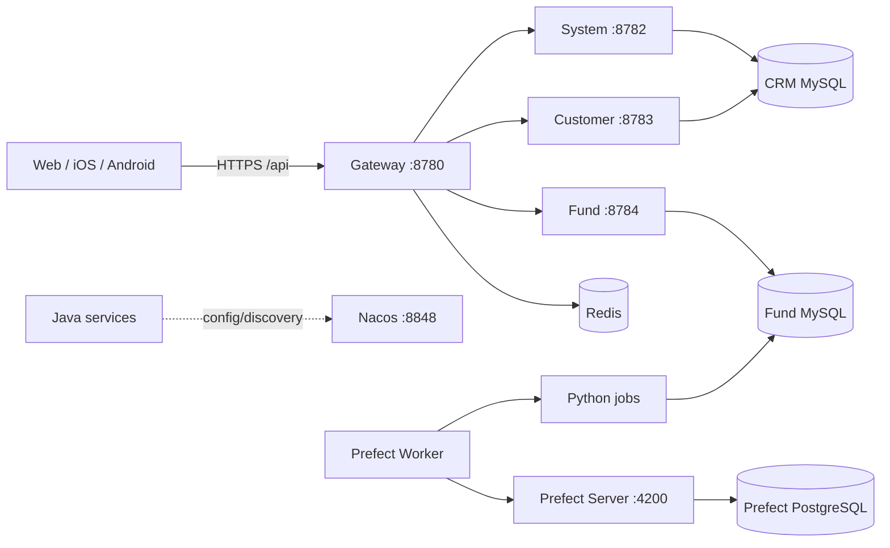

# CRM 管理与基金数据平台

这是一个前后端分离的多项目仓库，包含 CRM 微服务、基金数据采集与评分、Web 管理台，以及 iOS/Android 原生客户端。

## 从哪里开始

- 第一次接手：阅读 [开发手册总览](docs/manuals/README.md)。
- 理解服务关系：阅读 [系统架构与模块说明](docs/MODULES.md)。
- 查接口：阅读 [API 参考](docs/reference/API.md)。
- 查表和迁移：阅读 [数据库参考](docs/reference/DATABASE.md)。
- 上生产：阅读 [部署与运维手册](docs/manuals/DEPLOYMENT.md)。
- 补基础：从 [项目导向学习教程](docs/learning/README.md) 选择 Java、Python、iOS 或 Android。

## 项目地图

| 项目 | 路径 | 技术 | 主要职责 | 手册 |
| --- | --- | --- | --- | --- |
| Java 后端 | `backend/` | Java 8、Spring Boot 2.7、Spring Cloud | 网关、认证、客户、基金、权限 | [BACKEND.md](docs/manuals/BACKEND.md) |
| Python 数据任务 | `fund_spider/` | Python、Requests、PyMySQL、Prefect 3 | 基金/资讯/行情采集、评分与调度 | [PYTHON.md](docs/manuals/PYTHON.md) |
| Web 管理台 | `frontend/` | React、TypeScript、Vite、Ant Design | 运营管理与数据展示 | [FRONTEND.md](docs/manuals/FRONTEND.md) |
| iOS | `ios/CrmMobile/` | Swift、SwiftUI、URLSession | iPhone 原生客户端 | [IOS.md](docs/manuals/IOS.md) |
| Android | `android/CrmMobileAndroid/` | Java、Activity、HttpURLConnection | Android 原生客户端 | [ANDROID.md](docs/manuals/ANDROID.md) |
| 部署 | `deploy/` | Nacos、Redis、Nginx、Prefect、systemd | 本地基础设施与生产运行 | [DEPLOYMENT.md](docs/manuals/DEPLOYMENT.md) |
| 数据库 | `sql/`、`fund_spider/sql/` | MySQL、PostgreSQL | CRM、基金业务及 Prefect 元数据 | [DATABASE.md](docs/reference/DATABASE.md) |

## 最小运行拓扑



外部调用只能走 Gateway 的 `/api/**`。Python 直接写 `fund` 数据库，Java `fund` 服务再将结果提供给 Web 和移动端。

## 本地快速启动

完整步骤和故障处理见各项目手册；下面只给出最短路径。

### 1. 初始化数据库

`sql/schema.sql` 会删除并重建 CRM 表，只能用于新建或可丢弃的本地库。

```sql
CREATE DATABASE crm CHARACTER SET utf8mb4 COLLATE utf8mb4_unicode_ci;
CREATE DATABASE fund CHARACTER SET utf8mb4 COLLATE utf8mb4_unicode_ci;
```

```bash
mysql -uroot -p crm < sql/schema.sql
mysql -uroot -p fund < fund_spider/sql/init.sql
mysql -uroot -p fund < fund_spider/sql/20260731_add_fund_scoring.sql
```

### 2. 启动 Nacos 与 Redis

```bash
cd deploy/nacos
docker compose up -d
docker compose ps
```

按 [Nacos 配置说明](deploy/nacos/README.md) 导入 `gateway-dev.yaml`、`system-dev.yaml`、`customer-dev.yaml`、`fund-dev.yaml` 和可选的 `admin-dev.yaml`。

### 3. 启动 Java 服务

分别打开终端：

```bash
cd backend
mvn -pl system -am spring-boot:run
```

```bash
cd backend
mvn -pl customer -am spring-boot:run
```

```bash
cd backend
mvn -pl fund -am spring-boot:run
```

```bash
cd backend
mvn -pl gateway spring-boot:run
```

### 4. 启动 Web

```bash
cd frontend
npm install
npm run dev
```

开发 API 地址默认是 `http://127.0.0.1:8780/api`。初始化脚本中的 `admin/admin123` 只用于本地开发，生产必须禁用默认密码。

### 5. 启动 Python/Prefect

```bash
cd fund_spider
python3 -m venv .venv
source .venv/bin/activate
pip install -r requirements.txt
cp .env.example .env
```

本地调度平台的启动、Deployment 注册和 Worker 运行见 [Python 手册](docs/manuals/PYTHON.md#prefect-任务平台)。

## 默认端口

| 组件 | 端口 | 用途 |
| --- | ---: | --- |
| Nacos | 8848 | Java 配置与服务发现 |
| Redis | 6379 | Gateway 限流 |
| Gateway | 8780 | 外部 API 入口 |
| Admin | 8781 | 兼容服务/访问日志接收 |
| System | 8782 | 登录、用户、角色、菜单 |
| Customer | 8783 | 客户、联系人、跟进记录 |
| Fund | 8784 | 基金、持仓、资讯、股票 |
| Frontend | 5173 | Vite 开发服务器，实际端口以终端输出为准 |
| Prefect | 4200 | Flow/Deployment 控制台与 API |
| Prefect PostgreSQL | 5433 | 仅本机回环地址暴露 |

## 文档维护约定

1. Controller、客户端 API、CLI、环境变量、表结构或端口变化时，同一提交更新对应手册和参考文档。
2. 项目 README 只保留快速入口；详细说明以 `docs/manuals/` 和 `docs/reference/` 为准。
3. 文档命令必须标明执行目录、前置条件、预期结果和生产风险。
4. 不提交真实密码、Token、证书、Cookie、签名文件或开发者本机绝对路径。
5. 发布文档中的第三方商店要求会变化，执行前必须重新检查文档中链接的官方规则。
