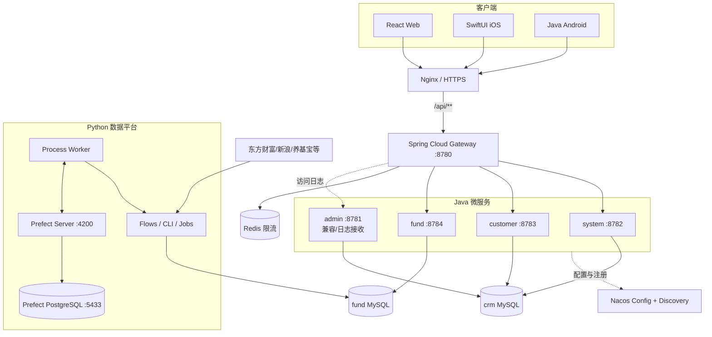
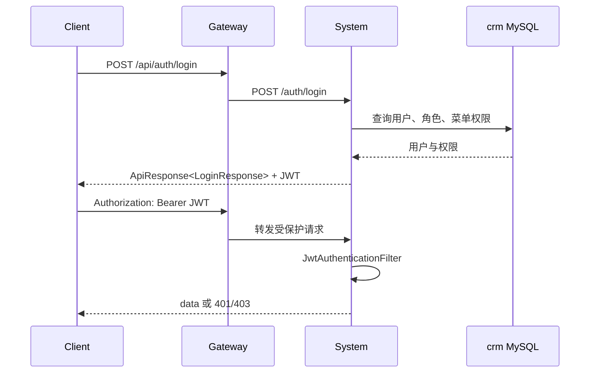
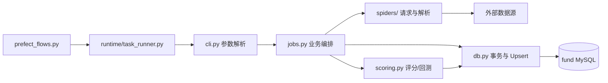

# CRM 系统架构与模块说明

本文是整个仓库的架构事实来源。具体命令在 [开发手册](manuals/README.md)，接口和表字段分别在 [API 参考](reference/API.md) 与 [数据库参考](reference/DATABASE.md)。

## 1. 系统边界

系统同时解决两类业务：

1. CRM：账号、角色、菜单、客户、联系人和跟进记录。
2. 投资数据：基金、净值、评级、持仓、评分、资讯、股票行情和用户基金持仓。

Web、iOS、Android 都是 API 客户端。Python 不是在线 API 服务，它负责从外部来源采集/计算后写入 `fund` MySQL。Java `fund` 服务读取这些数据并对外提供接口。



生产环境中 Nginx 是唯一公网入口；Nacos、Redis、MySQL、Prefect、PostgreSQL 和下游 Java 端口都应处于内网。

## 2. 运行时请求拓扑

### 2.1 路由

Gateway 接收 `/api/**`，使用 `StripPrefix=1` 去掉 `/api` 后转发：

| 外部前缀 | 服务 | 下游前缀 |
| --- | --- | --- |
| `/api/auth/**`、`/api/users/**`、`/api/roles/**`、`/api/menus/**` | `system` | `/auth/**` 等 |
| `/api/customers/**`、`/api/contacts/**`、`/api/follow-records/**` | `customer` | `/customers/**` 等 |
| `/api/funds/**`、`/api/news/**`、`/api/stocks/**`、`/api/portfolio/**` | `fund` | `/funds/**` 等 |

路由事实来源是 `deploy/nacos/gateway-dev.yaml`。修改本地文件不会自动改变已运行的 Nacos 配置，必须发布并验证。

### 2.2 登录与鉴权



JWT 在各业务服务本地校验，密钥和过期时间必须一致。`@PreAuthorize` 使用两种表达式：系统管理多为 `hasRole('ADMIN')`，业务功能使用 `hasAuthority('permission:code')`。

### 2.3 通用请求约定

- API Base：本地 `http://127.0.0.1:8780/api`，生产必须是 HTTPS 域名下的 `/api`。
- 客户端来源：`X-Client-Source` 使用 `web`、`ios`、`android` 或明确的测试标识。
- 受保护请求：`Authorization: Bearer <token>`。
- 响应：`{"code":0,"message":"ok","data":...}`；客户端只消费 `data`。
- 分页：MyBatis-Plus 返回 `records/current/size/total/pages` 等字段。

## 3. Java 后端

`backend/pom.xml` 是 Maven 父工程，统一使用 Java 8 字节码、Spring Boot 2.7.18、Spring Cloud 2021.0.8、Spring Cloud Alibaba 2021.0.5.0、Nacos Client 2.4.3 和 MyBatis-Plus 3.5.5。

| 模块 | 类型 | 服务名/端口 | 职责 | 数据库 |
| --- | --- | --- | --- | --- |
| `core` | 公共 Jar | 不启动 | 响应、异常、安全、日志、MyBatis、CORS | 无 |
| `gateway` | WebFlux 服务 | `gateway/8780` | 路由、CORS、Redis 限流、访问日志 | 无 |
| `system` | MVC 服务 | `system/8782` | 登录、用户、角色、菜单 | `crm` |
| `customer` | MVC 服务 | `customer/8783` | 客户、联系人、跟进记录 | `crm` |
| `fund` | MVC 服务 | `fund/8784` | 基金、评分、持仓、资讯、股票 | `fund` |
| `admin` | 兼容服务 | `admin/8781` | 原单体接口、Gateway 日志接收 | `crm` |

标准业务分层：

```text
Controller -> Service interface -> ServiceImpl -> Mapper -> MySQL
      |               |                |
      DTO         事务/业务规则       XML 或 MyBatis-Plus
```

`fund` 的股票 Controller 直接使用 `JdbcTemplate`，这是当前实现事实，不是全局推荐模式。新增功能应优先延续模块内已有稳定模式，跨模块通用行为才进入 `core`。

## 4. Python 数据任务

`fund_spider/` 的主链路：



职责边界：

| 文件/目录 | 职责 |
| --- | --- |
| `cli.py` | 唯一人工命令入口、参数到环境变量的映射 |
| `jobs.py` | 一次任务的选择、批次、提交和失败统计 |
| `spiders/` | 数据源 URL、请求、重试、限速、页面/API 解析 |
| `db.py` | 连接配置、DDL 兜底、查询、事务、幂等写入 |
| `scoring.py` | 因子快照、评分、概率校准、回测和任务队列 |
| `prefect_flows.py` | Prefect Flow/Task 定义 |
| `prefect.yaml` | Deployment、时间表、时区与并发限制 |
| `runtime/task_runner.py` | 子进程执行、跨进程锁和业务日志 |
| 旧调度器 | APScheduler、自研调度页和对应启动脚本已删除；Prefect 是唯一调度面 |

Python 业务数据写入 MySQL；Prefect 的 Deployment、运行状态、事件和日志元数据写入独立 PostgreSQL。

## 5. Web 管理台

`frontend/` 是单页 React 应用：

| 文件 | 职责 |
| --- | --- |
| `src/api.ts` | 类型、Token 请求封装和全部 API 函数 |
| `src/App.tsx` | 登录后的菜单、页面、表格、表单和业务交互 |
| `src/styles.css` | 全局布局和业务样式 |
| `vite.config.ts` | 开发/构建配置 |

`VITE_API_BASE` 应包含 `/api`。生产默认使用同源 `/api`，由 Nginx 反代到 Gateway。Token 保存在浏览器存储中，权限菜单来自 `/menus/mine`。

## 6. iOS

`ios/CrmMobile/` 是 iOS 16+ 的 SwiftUI 项目：

| 文件 | 职责 |
| --- | --- |
| `CrmMobileApp.swift` | App/Tab 入口及基金、持仓、资讯、股票等主要页面 |
| `ApiClient.swift` | async/await 网络、JSON、multipart 与错误处理 |
| `Models.swift` | `Codable` API 模型 |
| `SessionStore.swift` | Base URL、用户与 Token 的全局状态 |
| `KeychainStore.swift` | Token 持久化 |
| `LoginView.swift` | 登录与服务器地址输入 |
| `CustomerListView.swift` / `CustomerDetailView.swift` | 客户功能 |
| `SharedViews.swift` | 通用展示组件 |

主要业务集中在 `CrmMobileApp.swift`，维护时应控制修改范围；文档不会把当前实现误称为完整 MVVM。

## 7. Android

`android/CrmMobileAndroid/` 是 Java 原生 Android 工程，不使用 Kotlin、Compose、Retrofit 或 Room。

| 组件 | 当前实现 |
| --- | --- |
| UI | 每个业务页面一个 `Activity`，Java 代码构造界面 |
| 网络 | `ApiClient.java` + `HttpURLConnection` |
| JSON | `org.json` 手工解析到模型类 |
| 登录态 | `SessionStore` + `SharedPreferences` |
| 线程 | 后台线程请求，`runOnUiThread` 更新界面 |
| 构建 | Gradle、Android Gradle Plugin 8.5.2、compile/target SDK 35、min SDK 23 |

Manifest 当前允许 HTTP 明文流量，仅适合局域网开发。生产发布前必须切换到 HTTPS 并收紧网络安全策略。

## 8. 数据与所有权

| 数据 | 主要写入方 | 主要读取方 |
| --- | --- | --- |
| 用户/角色/菜单 | `system` | `system`、各客户端 |
| 客户/联系人/跟进 | `customer` | `customer`、各客户端 |
| API 日志 | Gateway/各服务，经 `admin` 接收 | 运维/管理功能 |
| 基金基础、净值、业绩、评级、持仓 | Python | `fund` Java、客户端 |
| 基金评分快照/结果/回测/任务 | Python 和 `fund` 服务各按职责写入 | `fund` 服务、Web/移动端 |
| 用户自选与用户持仓 | `fund` 服务 | `fund` 服务、客户端 |
| 资讯与股票行情 | Python | `fund` 服务、客户端 |
| Prefect 运行元数据 | Prefect Server | Prefect UI/API |

所有表的唯一键和迁移顺序见 [数据库参考](reference/DATABASE.md)。

## 9. 配置来源与优先级

### Java

1. `backend/*/src/main/resources/bootstrap.yml` 只负责应用名、profile 和 Nacos 地址。
2. Nacos 的 `<service>-<profile>.yaml` 提供端口、数据库、JWT、路由和 Actuator。
3. `${ENV:default}` 中的环境变量覆盖默认值。

### Python

1. 命令行参数被映射为大写环境变量。
2. 进程环境覆盖 `fund_spider/.env`。
3. 代码默认值最后生效。
4. Prefect 的时间表和 Deployment 默认值来自 `prefect.yaml`，UI 修改会改变运行态；长期变更需回写版本库。

### Web/移动端

- Web 构建时读取 `VITE_API_BASE`。
- iOS/Android 由用户在登录页输入 API Base，值必须包含 `/api`。
- 生产分发不应要求普通用户手工输入开发机 IP；应使用稳定 HTTPS 域名。

## 10. 可用性与安全边界

- Gateway 依赖 Redis；Redis 不可用时健康检查和限流可能使入口不可用。
- Java 服务依赖 Nacos 配置和注册；Nacos 内容缺失可能导致启动失败或 Gateway `503`。
- Python Flow 默认单并发，`task_runner` 还有跨进程锁，避免同类任务并发写库。
- `sql/schema.sql` 包含 `DROP TABLE`，严禁作为生产升级脚本。
- 本地 Nacos/Redis/JWT 示例包含开发默认值，生产必须通过受保护环境变量替换。
- Prefect UI 默认无业务级公网认证，只能通过 SSH 隧道、VPN 或带认证的反向代理访问。
- iOS 当前允许任意 ATS 加载、Android 当前允许明文 HTTP；两项均是开发便利配置，不是生产安全基线。

## 11. 维护热点

| 热点 | 风险 | 修改前动作 |
| --- | --- | --- |
| `CrmMobileApp.swift` | 文件大、多个页面共存，容易产生非局部影响 | 搜索类型名，做窄范围修改并完整构建 |
| `frontend/src/App.tsx` | 页面集中、菜单和状态相互关联 | 先更新 `api.ts` 类型，再改页面 |
| `fund_spider/db.py` | DDL、SQL、转换集中 | 对照 `init.sql` 和迁移，运行单元测试 |
| `scoring.py` | 时序隔离、概率校准和审批规则复杂 | 不用当前数据替代历史点时数据，运行评分测试 |
| `admin` 与微服务重复代码 | 容易修一处漏一处 | 先判断默认链路是否依赖 admin；兼容接口需明确同步策略 |
| Nacos YAML | 文件修改不等于运行态修改 | 发布后读取验证，再滚动重启 |

## 12. 变更影响矩阵

| 变更 | 必查位置 |
| --- | --- |
| REST 字段 | Java DTO/Entity、Web 类型、iOS `Codable`、Android JSON 解析、API 文档 |
| 新 API 前缀 | Controller、Gateway Nacos 路由、三端客户端、API 文档 |
| 权限码 | Controller、`sys_menu` 数据/迁移、角色授权、重新登录验证 |
| 表结构 | 增量 SQL、Python DB 层、Java Entity/Mapper、数据库文档、备份/回滚 |
| Python 命令/环境变量 | `cli.py`、`.env.example`、Prefect Flow、Python 手册 |
| 调度时间 | `prefect.yaml`、运行态 Deployment、发布记录 |
| 端口/域名 | Nacos、Nginx、客户端 Base URL、部署手册 |
| 移动端版本 | 工程版本号、签名、商店素材、隐私声明、发布记录 |

## 13. 新人排查顺序

1. 明确请求经过哪个客户端、Gateway 路由和下游服务。
2. 用 `curl` 检查 Gateway 健康及目标接口，而不是先改 UI。
3. 查看 Nacos 实例和 Java 日志；`503/401/403/429/5xx` 分别处理。
4. 数据为空时确认 Python Flow 最近成功时间、目标表和唯一键。
5. 对照 [API 参考](reference/API.md) 检查客户端解析。
6. 修复后跑最窄单元测试、模块构建和端到端冒烟测试。
