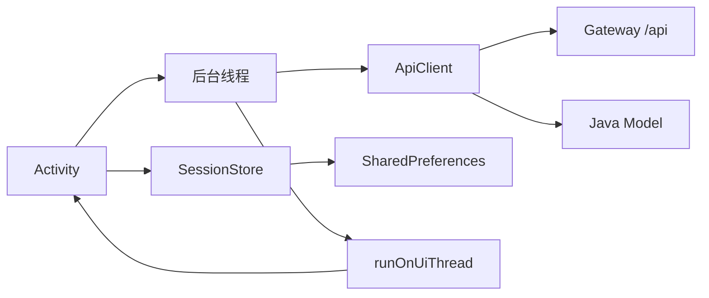

# Android 开发与多渠道发布手册

本文覆盖 `android/CrmMobileAndroid/` 的 Java Activity 架构、网络、线程、构建、签名、Google Play 与国内主流商店发布。路径与权限见 [API 参考](../reference/API.md)，JSON 字段见 [API 数据模型](../reference/API_MODELS.md)。

## 1. 当前工程

| 项 | 当前值 |
| --- | --- |
| 语言 | Java 8 |
| UI | 原生 Activity，Java 代码构建视图 |
| 网络 | `HttpURLConnection` |
| JSON | `org.json` 手工解析 |
| 登录态 | `SharedPreferences` |
| Android Gradle Plugin | 8.5.2 |
| compileSdk/targetSdk | 35/35 |
| minSdk | 23 |
| applicationId | `com.example.crm.android` |
| version | `versionCode=1`、`versionName=0.1.0` |

工程不使用 Kotlin、Jetpack Compose、Retrofit、OkHttp、Room 或依赖注入框架。维护文档和示例必须与当前 Java 技术栈一致。

## 2. 目录与职责

| 路径/文件 | 职责 |
| --- | --- |
| `app/src/main/AndroidManifest.xml` | 权限、应用属性、Activity 注册 |
| `LoginActivity.java` | Base URL、账号登录 |
| `MainTabActivity.java` | 主导航 |
| `CustomerListActivity.java` / `CustomerDetailActivity.java` | CRM 客户 |
| `ProductDetailActivity.java` 等 | 基金与详情 |
| `Portfolio*Activity.java` | 持仓、OCR 导入和详情 |
| `StockDetailActivity.java` | 股票历史 |
| `ApiClient.java` | URL、Header、JSON、multipart 和错误 |
| `SessionStore.java` | Base URL、Token、用户名持久化 |
| `*Model.java` | 业务模型和 JSON 映射 |
| `Ui.java` | 通用 UI 辅助 |

`ApiClient` 和模型类是接口变更的第一检查点；Activity 不应自行复制网络逻辑。

## 3. 架构与线程



规则：

- 主线程只处理 UI；网络和大 JSON/OCR 处理放后台线程。
- 后台完成后用 `runOnUiThread` 更新界面。
- Activity 销毁后避免继续引用旧 View；长任务至少检查生命周期/finishing 状态。
- Token、Base URL 和用户名由 `SessionStore` 管理，不在每个 Activity 各存一份。

## 4. 环境准备

推荐 Android Studio 当前稳定版，安装 Android SDK 35、Platform Tools 和匹配 JDK。

```bash
java -version
adb version
```

用 Android Studio 打开：

```text
android/CrmMobileAndroid
```

当前仓库没有 Gradle Wrapper，命令行需要系统 `gradle`，且版本必须与 AGP 8.5.2 兼容：

```bash
cd android/CrmMobileAndroid
gradle --version
gradle assembleDebug
```

长期维护建议单独变更补齐 Wrapper 并提交 wrapper JAR/配置，以锁定构建版本；这不是本次文档整理对代码的修改。

## 5. 联调地址

Base URL 必须包含 `/api`：

| 场景 | 地址 |
| --- | --- |
| Android Emulator | `http://10.0.2.2:8780/api` |
| 同局域网真机 | `http://<computer-LAN-IP>:8780/api` |
| 生产 | `https://<crm-domain>/api` |

真机的 `127.0.0.1` 是手机自己；标准 Emulator 用 `10.0.2.2` 指向宿主机。还要检查 Gateway 监听、防火墙和 Wi-Fi 隔离。

## 6. 网络与错误

`ApiClient` 负责：

- 规范化 Base URL。
- JSON GET/POST/PUT/DELETE。
- multipart 图片上传。
- `X-Client-Source: android`、User-Agent 和 Bearer Token。
- HTTP 与 `ApiResponse.code` 检查。
- 将可展示错误包装为 `ApiException`。

路径写 `/customers` 等，不写 `/api/customers`。连接和读取要有超时，流和连接在 `finally`/try-with-resources 中释放。

新增接口顺序：

1. 用 curl 从 Gateway 获取真实响应。
2. 新增/修改模型类和防御性 JSON 解析。
3. 在 `ApiClient` 增加方法。
4. Activity 在后台线程调用，主线程渲染。
5. 覆盖正常、空值、空列表、403、500 和网络中断。

## 7. JSON 模型

手工解析时区分：

- 必填：缺失就抛有上下文的解析错误。
- 可选：先 `has`/`isNull`，不要把 JSON `null` 变成字符串 `"null"`。
- 金额：避免直接用二进制浮点做持仓累计；展示前保留后端精度。
- 日期：保持服务端格式，统一显示转换。
- ID：选择 `int/long` 与后端范围匹配。

接口字段变化需要同时搜索模型构造、Getter、Activity 展示和排序比较器。

## 8. Activity 开发模板

一个页面至少有：

1. `onCreate`：读取 Intent 和 Session、建立视图、绑定事件。
2. `load...`：防重复、展示 loading、启动后台线程。
3. 后台：调用 ApiClient，不触碰 View。
4. 主线程：检查 Activity 状态、更新数据/空态/错误。
5. 导航：用明确 Intent extra，目标 Activity 在 Manifest 注册。

不要在匿名线程中长期持有大 Bitmap 或 Activity。图片上传前按后端限制读取和压缩，失败后及时释放字节数组/流。

## 9. 登录态

登录成功后 `SessionStore` 保存 Base URL、Token、用户名。后续 `ApiClient` 自动发送 Token。退出应清除敏感会话并返回登录页，防止返回栈重新进入业务页。

SharedPreferences 不是硬件级秘密存储。生产安全评审应考虑使用 Android Keystore 加密 Token，并评估备份、Root 设备和日志泄露风险。

## 10. 基金与持仓规则

- 基金表格固定名称/代码，指标横向滚动；排序字段与后端白名单一致。
- 概率为空表示配置未验证，不能显示 0% 冒充结果。
- 股票列表和历史分页大小最大受后端限制。
- OCR 上传支持来源平台和导入类型；预览必须允许校正并明确确认。
- 持仓快照覆盖同平台，交易明细只调整同平台已有基金。
- 网络回调更新 Adapter/View 前检查数据是否属于当前筛选条件，避免旧请求覆盖新筛选结果。

## 11. 明文 HTTP 与生产安全

Manifest 当前：

```xml
android:usesCleartextTraffic="true"
```

只适合局域网开发。生产发布前必须：

1. API 使用 HTTPS 和可信证书。
2. 将全局明文访问关闭；需要开发例外时使用构建变体/最小 Network Security Config。
3. 禁止 `debuggable`、测试域名、日志 Token 和测试账号进入 release。
4. 评估 Token 的 Keystore 加密。
5. 隐私政策和商店数据安全表与真实数据收集一致。
6. 对截图/OCR 这类用户敏感数据明确用途、存储、传输和删除策略。

当前工程还没有完成这些生产整改，不能仅凭 `assembleRelease` 成功就判定可上架。

## 12. Debug 构建与安装

```bash
cd android/CrmMobileAndroid
gradle clean assembleDebug
```

产物通常位于：

```text
app/build/outputs/apk/debug/app-debug.apk
```

安装：

```bash
adb devices
adb install -r app/build/outputs/apk/debug/app-debug.apk
```

日志：

```bash
adb logcat | rg 'AndroidRuntime|com.example.crm.android'
```

## 13. 测试

当前工程没有自动化测试目录，最低人工矩阵：

| 场景 | 验收 |
| --- | --- |
| 首次启动 | Base URL 校验、错误账号提示 |
| 登录恢复 | 重启后会话符合预期，退出彻底清理 |
| 客户 | 搜索、分页、详情、空列表 |
| 基金 | 筛选、排序、详情、图表/评分空值 |
| 资讯/股票 | 分类、列表、详情/历史 |
| 持仓 | 列表、OCR 多图、预览修改、确认和批次详情 |
| 网络 | 无网、超时、403、429、503、服务端业务错误 |
| 生命周期 | 请求时旋转/返回/切后台不崩溃 |

后续新增解析/计算时应补 `test/` 单元测试，Activity 流程补 `androidTest/`。

## 14. Release 签名

当前 `app/build.gradle` 没有生产 `signingConfig`。正式发布前由组织生成并托管签名密钥：

```bash
keytool -genkeypair -v \
  -keystore '<secure-path>/crm-release.jks' \
  -alias crm \
  -keyalg RSA -keysize 2048 -validity 10000
```

原则：

- JKS、密码、alias 密码不提交仓库。
- 密钥至少有两份加密备份和明确保管/恢复人。
- 更新必须使用与历史版本兼容的签名；丢失密钥可能导致无法升级。
- Gradle 从未提交的 properties/环境变量读取秘密。
- 每次发布递增 `versionCode`，按产品版本更新 `versionName`。

Android Studio 可使用 Build → Generate Signed Bundle/APK。Google Play 新应用优先生成签名 AAB；国内渠道通常要求签名 APK，以各渠道当期规则为准。

## 15. Google Play

官方流程（链接于 2026-08-01 核验）：

1. 创建 Play Console 应用，填写默认语言、名称、联系方式和声明。
2. 完成商店资料、隐私政策、Data safety、内容分级、目标受众、广告/权限等要求。
3. 配置 Play App Signing，安全保存 upload key。
4. 上传递增 `versionCode` 的 AAB。
5. 先走 Internal testing，再按需要 Closed/Open testing。
6. 处理预发布报告和所有阻塞错误，填写版本说明。
7. 创建 Production release；更新版本使用 staged rollout，监控崩溃/ANR/API 指标后扩大比例。

权威入口：[Publish your app](https://developer.android.com/studio/publish/)、[Upload your app to Play Console](https://developer.android.com/studio/publish/upload-bundle)、[Create and set up your app](https://support.google.com/googleplay/android-developer/answer/9859152)、[Prepare and roll out a release](https://support.google.com/googleplay/android-developer/answer/9859348)。目标 API 和账号测试要求会变化，发布当日必须重查。

## 16. 国内主流渠道

共性准备材料：

- 企业/个人开发者实名认证和有权使用的软件名称、包名、签名证明。
- 签名 release APK、版本说明、应用图标、截图、简介、分类和客服联系方式。
- 可公开访问的隐私政策、用户协议、注销/账号删除路径说明。
- 应用实际权限用途、数据收集共享说明、第三方 SDK 清单。
- 测试账号、审核操作说明及业务所需版权/行业资质。

渠道入口（2026-08-01 核验）：

| 渠道 | 官方入口 | 操作重点 |
| --- | --- | --- |
| 华为应用市场 | [AppGallery](https://developer.huawei.com/consumer/cn/appgallery/) | 实名、创建应用、APK、基础/分发信息、隐私声明与资质 |
| 小米应用商店 | [小米开放平台](https://dev.mi.com/distribute/doc/home) | 包名和签名一致、APK、资料和审核规范 |
| OPPO 软件商店 | [OPPO 文档中心](https://open.oppomobile.com/new/wiki) | 开发者认证、应用发布、审核规范和兼容测试 |
| vivo 应用商店 | [vivo 开放平台](https://dev.vivo.com.cn/) | 账号认证、应用管理、隐私与审核要求 |
| 应用宝 | [腾讯应用开放平台](https://app.open.qq.com/p/) | 应用创建、签名包、资料、资质和审核反馈 |

各渠道页面常由控制台动态呈现，所需资质会随应用类别和法规变化。本手册不替代法律/合规审查；每次发布在渠道后台重新导出检查项并保存发布记录。

### 多渠道一致性

- 同一 `applicationId` 和签名，保证用户可升级。
- `versionCode/versionName` 与发布台账一致。
- 每个渠道上传包计算 SHA-256，保存构建 commit、时间和签名证书指纹。
- 渠道 SDK/配置若不同，使用明确 flavor；当前工程没有 flavor，不要手工修改同一产物后失去可复现性。

## 17. 发布与回滚

发布顺序：

1. 后端保持向后兼容并完成生产冒烟。
2. 冻结版本，更新 version，生成同一 commit 的签名 AAB/APK。
3. 在至少一台 minSdk、一台 target/new SDK 设备做 release 冒烟。
4. 内测/灰度，监控崩溃、ANR、登录、API 4xx/5xx 和 OCR。
5. 分渠道提交并记录审核状态、包校验和和上线时间。

已上线包不能原地回滚：

- 商店支持灰度时停止扩大或暂停发布。
- 后端使用兼容/开关止损，不能直接删除旧客户端依赖的字段。
- 修复版必须提高 `versionCode` 并使用同一签名。
- 如需下架，现有用户仍可能保留旧版本，服务端兼容策略仍要存在。

## 18. 常见故障

| 现象 | 原因 | 处理 |
| --- | --- | --- |
| Emulator 连不上 | 用了宿主 `127.0.0.1` | 改 `10.0.2.2` |
| 真机连不上 | IP/防火墙/Wi-Fi 隔离 | 用电脑 LAN IP，检查端口 |
| `NetworkOnMainThreadException` | 主线程请求 | 移到后台线程 |
| JSON 崩溃 | null/字段类型变化 | 防御解析并对照响应 |
| `403` | Token/权限 | 重新登录、查角色权限 |
| `INSTALL_FAILED_UPDATE_INCOMPATIBLE` | 签名不同 | 卸载测试包或使用原签名 |
| Release 构建失败 | signingConfig/秘密缺失 | 检查安全 properties/环境变量 |
| 商店拒审 | 隐私/权限/资质/功能不符 | 按官方反馈修复，保持多渠道台账 |

## 19. 提交/发布前检查

- [ ] 仍为 Java/Activity 架构，未混入未批准的新栈。
- [ ] 网络不在主线程，生命周期和错误处理完整。
- [ ] JSON 模型与真实接口一致，null/金额/日期已验证。
- [ ] `gradle assembleDebug` 通过，关键流程设备冒烟通过。
- [ ] 生产使用 HTTPS、禁用全局明文和调试日志。
- [ ] version 递增，签名密钥可恢复且未入库。
- [ ] AAB/APK 的 commit、SHA-256、证书指纹和渠道已记录。
- [ ] 隐私、权限、测试账号和渠道材料与真实功能一致。
- [ ] API/项目/发布文档已同步。
