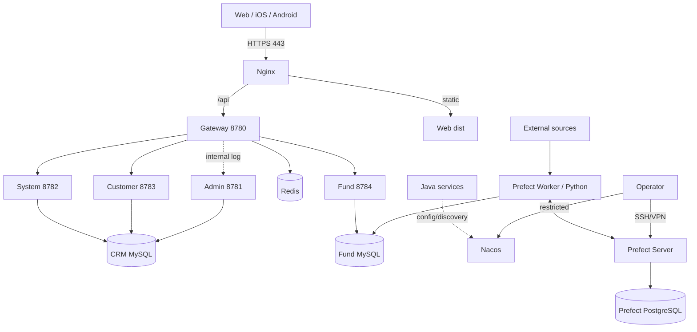

# CRM 部署与运维手册

本文覆盖本地基础设施、生产拓扑、发布、备份、回滚、巡检和故障处理。Java/Python/移动端细节分别见对应项目手册；完整变量、日常值班和生产阻塞项见 [配置参考](../reference/CONFIGURATION.md)、[维护与交接手册](MAINTENANCE.md) 和 [已知限制](../reference/KNOWN_LIMITATIONS.md)。

## 1. 环境与责任边界

| 环境 | 目标 | 允许事项 | 禁止事项 |
| --- | --- | --- | --- |
| local | 快速开发 | 示例密码、HTTP 局域网、全量重建测试库 | 使用生产数据/密钥 |
| test/staging | 集成与发布演练 | 脱敏数据、真实拓扑、签名测试包 | 与生产共享数据库/Token |
| production | 稳定服务 | HTTPS、最小权限、备份、审计、滚动发布 | dev 默认值、直接删表、裸露控制台 |

每次发布明确：发布负责人、数据库负责人、验证人、回滚决策人和业务窗口。

## 2. 生产拓扑



公网只暴露 Nginx HTTPS。MySQL、Redis、Nacos、Prefect、PostgreSQL 和 Java 下游端口放在私网/回环地址并用防火墙限制。

## 3. 本地基础设施

### Nacos 与 Redis

```bash
cd deploy/nacos
docker compose up -d
docker compose ps
```

验证：

```bash
curl -fsS http://127.0.0.1:8848/nacos/v1/ns/operator/metrics
redis-cli -h 127.0.0.1 -p 6379 ping
# 如果已启用密码，再按受保护的密码注入方式执行认证检查。
```

期望 `PONG`。当前 Compose Redis 没有密码，而 Gateway 开发 YAML 默认密码为 `qwer8989`；本地必须给 Redis 设置同一密码，或以空 `REDIS_PASSWORD` 启动 Gateway。未对齐时容器虽正常，Gateway health 仍会失败。仓库开发 Compose 的默认值不可用于生产。

### Prefect PostgreSQL

```bash
cp deploy/prefect/.env.example deploy/prefect/.env
# 编辑 .env，替换示例密码
docker compose -f deploy/prefect/docker-compose.yml up -d
docker compose -f deploy/prefect/docker-compose.yml ps
```

数据库只绑定 `127.0.0.1:5433`。命名卷 `crm-prefect-postgres-data` 保存调度元数据，正常停机不要使用 `down -v`。

Compose `.env` 不会自动进入 Prefect Server Shell。Server 的 `PREFECT_SERVER_DATABASE_CONNECTION_URL` 必须使用同一个、已 URL 编码的密码；CentOS 由 `/etc/crm/fund-spider.env` 注入，本地终端需显式 export。

## 4. Nacos 配置管理

### Data ID

```text
gateway-<profile>.yaml
admin-<profile>.yaml
system-<profile>.yaml
customer-<profile>.yaml
fund-<profile>.yaml
```

版本库的 `deploy/nacos/*-dev.yaml` 是开发基线，不是可直接复制到生产的安全配置。生产至少调整：

- profile/namespace/group 隔离。
- MySQL/Redis 地址与独立账号。
- JWT 和访问日志 Token。
- CORS 允许源。
- Actuator 暴露与网络 ACL。
- Nacos 自身鉴权、存储和访问控制。

### 发布和读回

开发示例：

```bash
cd deploy/nacos
curl -fsS -X POST 'http://127.0.0.1:8848/nacos/v1/cs/configs' \
  --data-urlencode 'dataId=gateway-dev.yaml' \
  --data-urlencode 'group=DEFAULT_GROUP' \
  --data-urlencode 'type=yaml' \
  --data-urlencode 'content@gateway-dev.yaml'
```

```bash
curl -fsS \
  'http://127.0.0.1:8848/nacos/v1/cs/configs?dataId=gateway-dev.yaml&group=DEFAULT_GROUP'
```

生产由受权操作员使用受保护的 Nacos 地址/凭据，发布前后保存脱敏配置版本和校验结果。禁止把生产 YAML 回写到仓库。

## 5. 密钥与环境变量

| 秘密 | 使用方 | 要求 |
| --- | --- | --- |
| CRM MySQL 密码 | system/customer/admin | 独立低权限账号，秘密管理器注入 |
| Fund MySQL 密码 | fund/Python | Java 读写和 Python 写入可进一步拆账号 |
| `CRM_JWT_SECRET` | system/customer/fund/admin | 各服务一致，足够随机，轮换有失效预案 |
| Redis 密码 | gateway | 不对公网，限制网络和命令权限 |
| `CRM_ACCESS_LOG_TOKEN` | gateway/admin | 两侧一致，仅内部传输 |
| YJB Header/Cookie | Python | 短期、授权来源、日志脱敏 |
| Prefect PostgreSQL 密码 | Prefect | URL 编码后写连接串 |
| iOS/Android 签名资产 | 移动发布 | 不入库，加密备份，最小访问 |

受保护环境文件建议权限：

```bash
sudo chown root:crm /etc/crm/fund-spider.env
sudo chmod 640 /etc/crm/fund-spider.env
```

服务进程只获得自己需要的秘密。日志、`ps` 参数、Shell history 和 CI 输出中不得出现秘密。

## 6. 构建产物

### Java

```bash
cd backend
mvn test
mvn -DskipTests package
```

产物为各服务 `target/*-0.1.0.jar`。发布前计算校验和：

```bash
shasum -a 256 gateway/target/*.jar system/target/*.jar \
  customer/target/*.jar fund/target/*.jar admin/target/*.jar
```

### Web

```bash
cd frontend
npm ci
VITE_API_BASE=/api npm run build
```

产物是 `frontend/dist/`。

### Python

Python 以确定 commit、`requirements.txt`、迁移和 `prefect.yaml` 作为发布单元，不生成单一可执行包。生产虚拟环境按确定依赖构建并记录 `pip freeze` 供审计。

### 移动端

- iOS：Xcode Archive/签名 build，版本和 build 递增。
- Android：同一 commit 生成签名 AAB 和渠道 APK，版本码递增。

详细签名和商店步骤见 [iOS 手册](IOS.md) 与 [Android 手册](ANDROID.md)。

## 7. 数据库发布

发布前：

1. 备份 CRM MySQL、Fund MySQL 和 Prefect PostgreSQL。
2. 在生产备份副本演练所有增量迁移。
3. 记录表行数、结构、执行时间、锁表影响和回滚/前向修复方案。
4. 确认新旧应用短暂共存时都能使用迁移后的结构。

严禁：

- 对生产运行 `sql/schema.sql`。
- 未备份执行 `DROP/TRUNCATE`。
- 在发布故障中临时编写未经审阅的逆向 SQL。
- 把 ORM/`ensure_schema` 自动建表当作正式迁移系统。

命令和表清单见 [数据库参考](../reference/DATABASE.md)。

## 8. 生产发布

### 8.1 发布前门禁

- [ ] 变更范围、commit、产物 SHA-256 和依赖已记录。
- [ ] 自动测试/构建通过，staging 走完端到端冒烟。
- [ ] 数据库备份可读且最近恢复演练有效。
- [ ] 迁移、Nacos、服务、Web、任务和客户端兼容顺序明确。
- [ ] 上一版本产物/配置可用，回滚触发条件明确。
- [ ] 监控面板、日志、值班人和业务通知就绪。

### 8.2 顺序


具体顺序可因兼容设计跳过未变更组件，但不能跳过依赖检查。

### 8.3 Java 滚动发布

仓库提供实例级脚本：

```bash
deploy/graceful-restart.sh system backend/system/target/system-0.1.0.jar 8782
deploy/graceful-restart.sh customer backend/customer/target/customer-0.1.0.jar 8783
deploy/graceful-restart.sh fund backend/fund/target/fund-0.1.0.jar 8784
deploy/graceful-restart.sh gateway backend/gateway/target/gateway-0.1.0.jar 8780
```

可选 Admin：

```bash
ACTUATOR_BASE=http://127.0.0.1:8781/api/actuator \
  deploy/graceful-restart.sh admin backend/admin/target/admin-0.1.0.jar 8781
```

脚本会先从注册中心摘流再发 SIGTERM。它不会等待新实例健康，单实例也无法做到零停机；多实例需逐个执行，并在每次启动后确认 healthy 和关键接口成功。生产应由 systemd/进程管理器托管；仓库当前没有完整 Java systemd unit，部署方需维护其权威配置。

### 8.4 Python/Prefect

按 `deploy/centos/README.md`：

1. 更新代码和 `.venv`。
2. 更新受保护环境文件。
3. 启动/检查 Prefect Server。
4. 执行 `deploy_prefect.sh`。
5. dry-run 和小批次真实任务。
6. 启动/重启 Worker。
7. 核对全部 Deployment 的计划、时区和启停状态。

### 8.5 Web/Nginx

将完整 `dist` 发布到版本目录，验证后原子切换 `current`。配置检查：

```bash
sudo nginx -t
sudo nginx -s reload
```

验证首页、静态资源、SPA 路由、`/api`、上传大小/超时和 HTTPS。

### 8.6 移动端

服务端先向后兼容，再发客户端。iOS 通过 TestFlight/分阶段发布，Android 通过 Play 测试轨道/灰度与国内渠道审核。客户端发布后无法立刻覆盖所有旧版本，后端必须保留兼容窗口。

## 9. 发布后冒烟

### 基础健康

生产不应通过公网暴露 Actuator；由内网监控分别检查
`http://<gateway-private-host>:8780/actuator/health` 和各下游 Actuator。
业务公网冒烟使用正式 `/api`：

1. 测试账号登录。
2. `/api/auth/me`。
3. 客户列表/详情。
4. 基金列表/详情、资讯、股票。
5. 持仓列表；OCR 用专用测试数据且不影响真实用户。
6. 评分配置/任务只做只读检查，避免误入队。
7. Web 页面和移动灰度包完成同样主链路。

同时检查 Nacos healthy、Gateway route、Redis、MySQL连接、Prefect Worker/Deployment、日志错误率和数据新鲜度。

## 10. 监控与巡检

| 对象 | 最低监控 |
| --- | --- |
| Nginx/Gateway | 可用率、4xx/5xx/429、延迟、连接数 |
| Java 服务 | health、JVM、线程、GC、错误、Nacos 实例 |
| Redis | 可用、内存、连接、延迟、拒绝/淘汰 |
| MySQL | 连接、慢查询、锁、复制/备份、磁盘 |
| Prefect | Server health、Worker heartbeat、Flow 成败/时长/队列 |
| 数据 | 净值/资讯/行情/评分最近更新时间、行数异常 |
| 移动端 | 崩溃、ANR、登录失败、API 版本错误 |

日常巡检至少回答：服务是否健康、数据是否新鲜、最近备份是否成功、是否有未消费任务、证书/磁盘是否临近阈值。

## 11. 回滚

### 触发条件示例

- 核心登录/查询不可用且短时间无法止损。
- 5xx、延迟或资源使用显著超过基线。
- 数据写入错误、重复或跨用户污染。
- 评分/OCR 等关键计算出现系统性错误。

### 顺序

1. 停止扩大移动/服务灰度；暂停受影响 Prefect Deployment。
2. 如写入可能破坏数据，先停止写入方并保存证据，不立即覆盖数据库。
3. 回切上一 Web 静态目录和上一 Jar/代码版本。
4. 恢复匹配的 Nacos 配置。
5. 数据库按预案恢复或前向修复；评估发布后新写数据。
6. 重跑健康与业务冒烟，确认数据一致。
7. 记录时间线、影响、决策与后续修复。

移动商店无法瞬时回退已安装二进制，应依赖服务端兼容/开关并发布更高版本号修复包。

## 12. 备份

MySQL 示例：

```bash
mysqldump -h '<db-host>' -u '<backup-user>' -p \
  --single-transaction --routines --triggers crm \
  > 'crm-YYYYMMDDHHMM.sql'
mysqldump -h '<db-host>' -u '<backup-user>' -p \
  --single-transaction --routines --triggers fund \
  > 'fund-YYYYMMDDHHMM.sql'
```

Prefect PostgreSQL 使用 `pg_dump`/平台快照。备份文件加密、异地保存、设置保留期和访问审计。每季度或按组织标准做恢复演练；“任务显示备份成功”不等于可恢复。

## 13. Nginx 要点

仓库示例是 `deploy/nginx.conf`。生产配置至少包含：

- HTTPS、证书续期和安全协议。
- 静态目录/SPA `try_files`。
- `/api/` 反代 Gateway。
- 真实客户端 IP Header 的可信代理边界。
- OCR 上传体积、超时和临时文件限制。
- 静态 hash 资源长缓存、`index.html` 短缓存。
- 访问/错误日志轮转和敏感查询脱敏。

任何修改先 `nginx -t`，再 reload；保留上一配置。

## 14. Prefect 控制台安全

默认 Server 监听 `127.0.0.1:4200`。远程访问：

```bash
ssh -L 4200:127.0.0.1:4200 '<user>@<server>'
```

本机访问 `http://127.0.0.1:4200/`。不要直接将无认证 UI/API 暴露到公网；如需团队访问，使用 VPN 或有身份认证、TLS 和审计的反向代理。

## 15. 常见故障

| 现象 | 第一检查点 |
| --- | --- |
| 全站不可用 | Nginx、Gateway、证书/DNS |
| Gateway `503` | Nacos 实例、下游健康 |
| Gateway `429` 激增 | Redis、限流参数、真实 IP 解析 |
| 登录全部失败 | System、CRM MySQL、JWT 配置 |
| 只有基金为空 | Fund MySQL、Python 数据新鲜度 |
| Prefect Flow 不启动 | Server、Worker、Pool/Queue、计划 paused |
| 同任务重复跑 | Deployment 重复注册或并发配置失效 |
| Web 新旧资源混合 | 非原子发布/缓存策略 |
| 真机失败但 Web 正常 | HTTPS/证书、Base URL、移动网络策略 |
| 磁盘快速增长 | Java/Python/Nginx 日志、MySQL、Prefect PostgreSQL |

## 16. 运维变更检查表

- [ ] 所有操作目标是明确环境和实例，没有使用未解析的宽泛路径/glob。
- [ ] 备份、恢复和回滚已验证，不删除 Docker volume。
- [ ] Nacos 文件和运行态均核对，生产秘密未写回仓库。
- [ ] 服务滚动、每实例健康和端到端冒烟完成。
- [ ] Prefect Deployment、计划、工作池和并发配置唯一且一致。
- [ ] Web 原子切换，移动端保持服务端兼容。
- [ ] 监控、告警、日志和数据新鲜度正常。
- [ ] 发布记录包含 commit、产物校验和、迁移、配置、操作者和结果。
