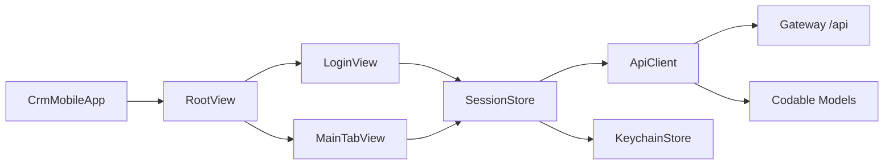

# iOS 开发与发布手册

本文覆盖 `ios/CrmMobile/` 的 SwiftUI 结构、网络、登录态、真机联调、构建、TestFlight 和 App Store 发布。接口契约见 [API 参考](../reference/API.md)。

## 1. 当前工程

| 项 | 当前值 |
| --- | --- |
| 语言 | Swift 5 |
| UI | SwiftUI |
| 最低系统 | iOS 16.0 |
| 网络 | `URLSession` + async/await |
| JSON | `Codable` |
| Token | Keychain |
| Bundle ID | `com.example.crm.mobile`（发布前确认归属和唯一性） |
| 工程 | `CrmMobile.xcodeproj` |

## 2. 文件与职责

| 文件 | 职责 |
| --- | --- |
| `CrmMobileApp.swift` | App/Root/Tab 入口，以及基金、持仓、资讯、股票等主要页面 |
| `ApiClient.swift` | URL、Header、JSON、multipart、状态码和错误处理 |
| `Models.swift` | API 响应、分页、CRM/基金/持仓/资讯/股票模型 |
| `SessionStore.swift` | Base URL、Token、用户名、登录/恢复/退出 |
| `KeychainStore.swift` | Token 的保存、读取和删除 |
| `LoginView.swift` | 服务器地址、用户名和密码 |
| `CustomerListView.swift` | 搜索、刷新、分页和导航 |
| `CustomerDetailView.swift` | 客户详情 |
| `SharedViews.swift` | 状态徽章和通用辅助 |

主要业务集中在 `CrmMobileApp.swift`，它不是严格 MVVM。修改时按 `struct <ViewName>` 搜索并做窄范围变更，避免无关格式化整个文件。

## 3. 架构与数据流



状态规则：

- 登录/服务器地址等跨页面状态放 `SessionStore`。
- 页面列表、筛选、loading 和错误使用局部 `@State`。
- 网络在 `Task`/async 函数中执行，UI 更新保持在 SwiftUI/Main Actor 语义内。
- Token 只进 Keychain，不进 `UserDefaults` 或日志。

## 4. 环境准备

需要完整 Xcode，不只是 Command Line Tools。

```bash
xcode-select -p
xcodebuild -version
```

如路径未指向完整 Xcode：

```bash
sudo xcode-select -s /Applications/Xcode.app/Contents/Developer
```

用 Xcode 打开：

```text
ios/CrmMobile/CrmMobile.xcodeproj
```

选择 `CrmMobile` scheme 和模拟器。真机首次运行需在 Signing & Capabilities 选择有权使用该 Bundle ID 的 Team。

## 5. 联调地址

Base URL 必须包含 `/api`。

| 场景 | 地址示例 |
| --- | --- |
| iOS Simulator | `http://127.0.0.1:8780/api` |
| 同局域网真机 | `http://<Mac-LAN-IP>:8780/api` |
| 生产 | `https://<crm-domain>/api` |

查看 Mac Wi-Fi 地址：

```bash
ipconfig getifaddr en0
```

真机的 `127.0.0.1` 是手机自己。还需确认 macOS 防火墙、Wi-Fi 客户端隔离和 Gateway 监听地址。

## 6. 网络层

`ApiClient` 初始化：

```swift
init(baseURL: String, token: String? = nil, session: URLSession = .shared)
```

公共 Header：

```text
Accept: application/json
Content-Type: application/json
X-Client-Source: ios
User-Agent: CrmMobile/iOS
Authorization: Bearer <token>
```

方法路径不带 `/api`。`performRequest` 同时处理 HTTP 状态、`ApiResponse.code`、JSON 解码和空数据；新增接口必须复用统一入口。

当前覆盖登录、客户、基金、净值、资讯、股票、用户持仓、OCR 预览/确认和导入历史，详见 [客户端接口覆盖](../reference/API.md#客户端接口覆盖)。

## 7. 新增接口

1. 在 [API 参考](../reference/API.md) 确认路径、权限和真实 JSON。
2. 在 `Models.swift` 新增/修改 `Decodable` 模型。
3. 可空字段用 Optional；金额优先 `Decimal`；日期先保留服务端字符串，除非全项目统一解析策略。
4. 在 `ApiClient.swift` 增加 async 方法，路径不带 `/api`。
5. 页面显示 loading、空态和 `error.localizedDescription`。
6. 用无 Token、过期 Token、空数据和正常数据验证。

示例：

```swift
struct Example: Decodable, Identifiable {
    let id: Int
    let name: String
    let note: String?
}

func listExamples() async throws -> [Example] {
    try await request(path: "/examples")
}
```

出现 `keyNotFound/typeMismatch/valueNotFound` 时先保存脱敏响应，对照模型修正，不要用全部 Optional 掩盖契约错误。

## 8. 页面开发

推荐页内状态：

```swift
@State private var rows: [Item] = []
@State private var loading = false
@State private var errorMessage: String?
```

标准加载：

1. 防止重复请求。
2. `loading=true`，使用 `defer` 复位。
3. 调用 `session.apiClient`。
4. 成功替换/追加数据并清理错误。
5. 失败保存用户可理解的错误；403 可提示重新登录。

分页必须处理刷新时清空、加载更多阈值、最后一页和重复记录。列表项 `id` 必须稳定，不能用易变化的展示字段临时充当唯一标识。

## 9. 登录态与 Keychain

登录：

1. `LoginView` 校验 Base URL、用户名、密码。
2. `SessionStore.login` 创建 ApiClient 并请求 `/auth/login`。
3. 成功后保存 Token、服务器地址和用户信息。
4. Token 经 `KeychainStore` 持久化。
5. 后续请求自动带 Bearer Token。

退出应删除 Keychain Token 和内存状态。Token 失效后不要无限重试原请求；清理登录态并让用户重新认证。

## 10. 基金、持仓和图表

- 基金列表为固定名称/代码 + 横向指标表，排序字段必须与后端白名单一致。
- 评分总分和盈利概率分别展示；后端概率为空时显示未验证，不显示伪造的 0%。
- 趋势图从净值序列计算，先按日期排序和区间过滤，处理不足两个点。
- OCR 选择图片后上传 multipart；预览行可编辑，确认前再次展示来源平台和导入类型。
- 持仓列表按 `scope/sortField/sortOrder` 与后端一致，Decimal 格式化不能丢精度。

## 11. ATS 与生产网络

`Info.plist` 当前 `NSAllowsArbitraryLoads=true`，只为局域网 HTTP 联调。生产发布前必须：

1. 使用受信任证书的 HTTPS API。
2. 删除全局任意加载，必要例外按域名最小化。
3. 验证证书链、域名、过期时间和重定向。
4. 不在 App 内硬编码测试 Token、IP 或私钥。
5. 评估隐私清单、数据收集说明与实际代码一致。

生产安全整改是发布门槛；仅在文档中说明风险不能替代代码修改和复测。

## 12. 构建与测试

无签名命令行构建：

```bash
xcodebuild \
  -project ios/CrmMobile/CrmMobile.xcodeproj \
  -scheme CrmMobile \
  -destination 'generic/platform=iOS' \
  -derivedDataPath /tmp/crm-ios-derived \
  CODE_SIGNING_ALLOWED=NO \
  build
```

当前工程没有独立 XCTest target，最低人工冒烟：

```text
首次启动 -> 输入 Base URL -> 登录 -> 客户列表/详情
-> 基金列表/详情/图表 -> 资讯 -> 股票 -> 持仓/OCR预览
-> 退出 -> 重启确认登录态行为
```

新增复杂解析、日期/金额计算或评分展示时应补 XCTest target，而不是只依赖手工点击。

## 13. 版本与签名

发布前同时更新：

- `CFBundleShortVersionString`：用户可见版本，例如 `1.1.0`。
- `CFBundleVersion`：每次上传递增的构建号。
- Bundle ID、Team、证书和 Provisioning Profile 必须属于同一开发者账号配置。

不要提交私钥、导出的 `.p12`、个人 provisioning profile 或账号密码。签名资产由 Apple Developer/App Store Connect 与组织的秘密管理方案托管。

## 14. TestFlight

官方流程（链接于 2026-08-01 核验）：

1. 在 App Store Connect 创建与 Bundle ID 对应的 App 记录。
2. Xcode 选择 `Any iOS Device (arm64)`，执行 Product → Archive。
3. Organizer 中 Validate，再 Distribute App → App Store Connect。
4. 等构建处理完成，填写测试说明、反馈邮箱和需要的合规信息。
5. 先分发内部测试组；通过关键流程后再申请外部测试审核。
6. 收集崩溃、会话和反馈，修复后上传递增 build。

Apple 当前说明 TestFlight 构建可测试 90 天；具体人数、合规字段和审核状态以 [TestFlight Overview](https://developer.apple.com/help/app-store-connect/test-a-beta-version/testflight-overview/) 为准。

## 15. App Store 发布

1. 完成名称、副标题、描述、关键词、分类、支持/隐私 URL、截图和 App Review 联系信息。
2. 确认隐私问卷与实际收集、存储和共享的数据一致。
3. 选择已通过测试的 build，填写版本说明和出口合规信息。
4. 在 App Review 信息中提供可用测试账号和必要操作路径，但不要提供生产管理员账号。
5. “Add for Review” 后在草稿 Submission 中正式 “Submit for Review”。
6. 选择手动、自动或分阶段发布策略；上线后监控崩溃、API 错误和用户反馈。

权威入口：[App Store Connect workflow](https://developer.apple.com/help/app-store-connect/get-started/app-store-connect-workflow)、[Submit an app](https://developer.apple.com/help/app-store-connect/manage-submissions-to-app-review/submit-an-app)、[App Review Guidelines](https://developer.apple.com/app-store/review/guidelines/)。规则变化时以官方页面为准。

## 16. 回滚

App Store 已发布二进制不能原地替换：

- 服务端优先保持向后兼容或使用服务端开关停用故障功能。
- TestFlight 停止分发故障 build，选择上一可用 build 给测试组。
- 正式版准备修复版本并提高 build/version；必要时在 App Store Connect 调整可用性。
- 后端回滚前确认旧 API 仍兼容已安装客户端。

## 17. 常见故障

| 现象 | 原因 | 处理 |
| --- | --- | --- |
| 真机无法连接 | 用了 `127.0.0.1`/防火墙 | 改 Mac 局域网 IP，检查端口 |
| `DecodingError` | 模型与 JSON 不一致 | 检查 coding key、类型和 Optional |
| `403` | Token 失效/权限不足 | 重新登录，核对角色权限 |
| HTTP 被阻止 | ATS 配置 | 开发最小例外；生产 HTTPS |
| Signing 失败 | Team/Bundle ID/Profile 不匹配 | Xcode Signing & Capabilities |
| 上传后没有 build | 处理中、版本/合规问题 | App Store Connect Activity/邮件 |
| 图表异常 | 日期无序/空值/区间太短 | 检查原始净值和转换函数 |

## 18. 提交/发布前检查

- [ ] Base URL 规则、Header、Bearer Token 和 Keychain 未破坏。
- [ ] Codable 与真实响应一致，空值/日期/金额有测试。
- [ ] loading、空态、错误和重复请求处理完整。
- [ ] 无签名 `xcodebuild` 通过，关键流程真机冒烟通过。
- [ ] 生产已使用 HTTPS 并移除全局 ATS 任意加载。
- [ ] 版本/build 递增，签名与 Bundle ID 正确。
- [ ] 隐私说明、截图、审核账号和发布说明就绪。
- [ ] API/项目/发布文档已同步，无证书和账号秘密入库。
