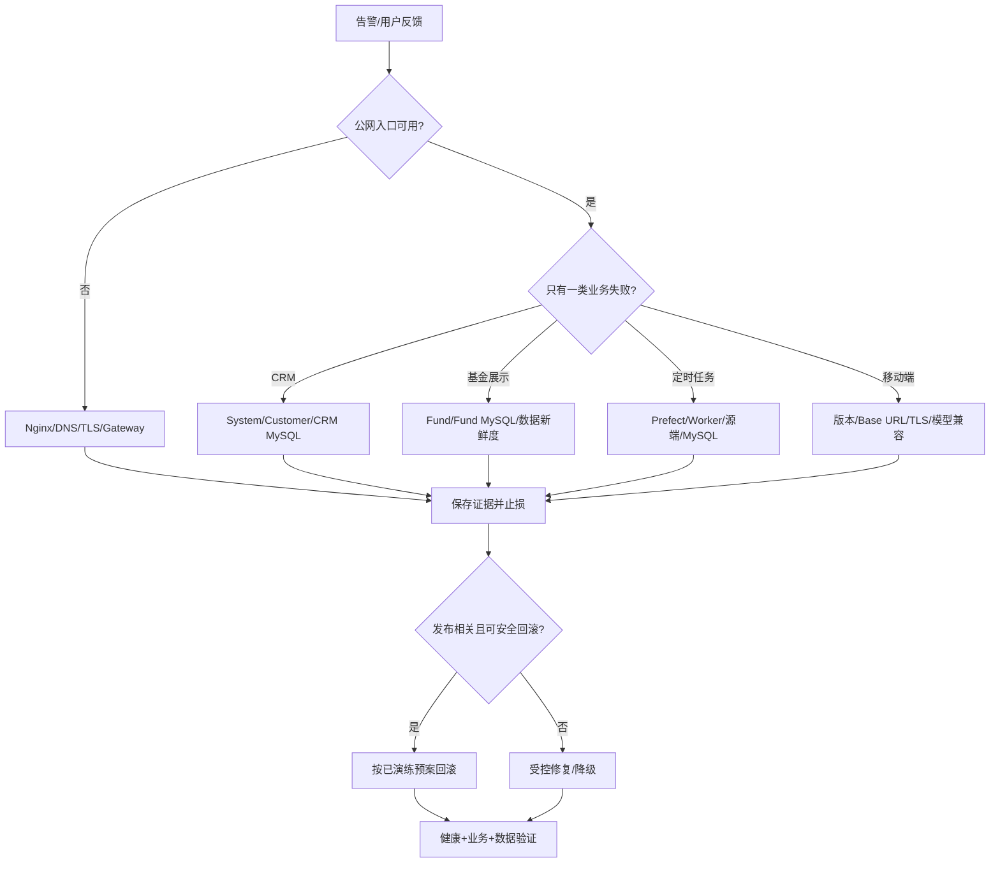

# CRM 日常维护、值班与交接手册

本文面向接手项目的开发、运维和值班人员，给出从“确认系统是否正常”到“事故止损、恢复和交接”的标准动作。架构、配置、接口和数据库细节分别见 [系统架构](../MODULES.md)、[配置参考](../reference/CONFIGURATION.md)、[API 参考](../reference/API.md) 和 [数据库参考](../reference/DATABASE.md)。

## 1. 接手前先确认的事实

不要仅凭 README 假设生产环境已经按示例部署。首次接手必须找出并记录：

| 类别   | 必须确认                                              |
| ---- | ------------------------------------------------- |
| 代码   | 生产 commit/tag、分支策略、仓库权限、最近发布人                     |
| 入口   | 正式域名、DNS、证书、Nginx 配置权威位置                          |
| Java | 每个服务实例、JDK、启动参数、systemd/容器/进程管理方式                 |
| 配置   | Nacos 地址、namespace/group/profile、配置备份和变更权限        |
| 数据   | CRM/Fund MySQL 地址、版本、备份、复制/PITR、只读诊断账号            |
| 任务   | Prefect 地址、Worker、Pool、Deployment、是否存在重复的外部调度     |
| 移动   | App Store/Play/国内渠道账号、Bundle/Application ID、签名保管人 |
| 监控   | 指标、日志、告警、值班群、通知链路和静默规则                            |
| 恢复   | 最近一次恢复演练时间、实际 RPO/RTO、回滚产物位置                      |
| 合规   | 隐私政策、数据保留期、第三方数据授权、审核测试账号                         |

缺失项应登记为风险并指定负责人，不能用仓库中的开发默认值自行补成“生产事实”。

## 2. 十分钟健康检查

### 2.1 入口和 Java

从内网/运维机执行：

```bash
curl -fsS 'http://<gateway-private-host>:8780/actuator/health'
curl -fsS 'http://<system-private-host>:8782/actuator/health'
curl -fsS 'http://<customer-private-host>:8783/actuator/health'
curl -fsS 'http://<fund-private-host>:8784/actuator/health'
```

再用专用低权限测试账号走公网 HTTPS：

```text
登录 -> /auth/me -> 客户列表 -> 基金列表/详情 -> 资讯 -> 股票 -> 持仓列表
```

健康接口成功不代表业务正常；至少验证一条真实 Gateway 路由和数据库读取。

### 2.2 Nacos 和 Redis

```bash
curl -fsS 'http://<nacos-private-host>:8848/nacos/v1/ns/instance/list?serviceName=system&groupName=<group>'
redis-cli -h '<redis-host>' -p '<redis-port>' --no-auth-warning -a '<password>' ping
```

无密码本地 Redis 不传 `-a`。检查所有预期实例 `healthy=true`，并确认没有已下线版本残留注册。

### 2.3 Prefect

```bash
curl -fsS 'http://127.0.0.1:4200/api/health'
cd /opt/crm/fund_spider
PREFECT_API_URL=http://127.0.0.1:4200/api \
  .venv/bin/prefect deployment ls
PREFECT_API_URL=http://127.0.0.1:4200/api \
  .venv/bin/prefect work-pool inspect crm-process-pool
```

确认最近 Flow 没有持续 Failed/Late/Crashed，Worker 在线，队列没有异常堆积。

### 2.4 数据新鲜度

```sql
SELECT MAX(nav_date) AS latest_nav FROM fund_nav_history;
SELECT MAX(create_time) AS latest_news FROM sina_finance_news;
SELECT MAX(trade_date) AS latest_stock FROM stock_daily_history;
SELECT data_type, MAX(last_success_at) AS last_success
FROM fund_refresh_state
GROUP BY data_type;
SELECT status, COUNT(*)
FROM fund_score_job
GROUP BY status;
```

“最新日期”必须结合交易日、周末、节假日和计划时间判断，不能机械要求每天变化。

## 3. 固定巡检节奏

### 每日

- 检查公网登录/核心查询、5xx/429、延迟和证书有效性告警。
- 检查 Java/Nacos/Redis/MySQL/Prefect Worker 健康。
- 检查净值、资讯、股票、评分数据新鲜度和异常行数。
- 检查失败/超时/重复 Flow、未消费 `fund_score_job`。
- 检查磁盘、日志增长、数据库连接/锁和备份任务结果。
- 对失败任务先识别根因；禁止无判断地高频重跑第三方采集。

### 每周

- 抽查一个备份文件校验和、可读性和异地副本。
- 检查 Nacos 运行配置与版本库基线的有意/意外漂移。
- 检查没有额外 systemd timer/crontab 与 Prefect 重复执行同一任务。
- 检查过期账号、权限变更、管理员账号和访问日志异常。
- 汇总第三方源结构变化、失败率、耗时和限流情况。
- 检查移动端崩溃/ANR、商店反馈和后端旧版本兼容情况。

### 每月

- 复核 [已知限制](../reference/KNOWN_LIMITATIONS.md) 的状态、负责人和目标版本。
- 审计依赖版本和安全公告，先在分支/测试环境升级并完整回归。
- 评估 MySQL/Prefect/日志容量趋势和保留策略执行情况。
- 复核 JWT、访问日志 Token、数据库/Redis/Nacos 权限和轮换计划。
- 抽查发布记录能否追溯 commit、产物 SHA-256、迁移和配置。

### 每季度或组织规定周期

- 在隔离环境实际恢复 CRM MySQL、Fund MySQL 和 Prefect PostgreSQL。
- 演练单服务回滚、Gateway 故障、Worker 故障和第三方源异常。
- 复核 RPO/RTO 是否与业务期望一致；只写目标不做演练无效。
- 复核隐私政策、OCR/日志/历史数据保留和账号删除流程。

## 4. 告警最低集合

| 类别          | 必须有的告警                                          |
| ----------- | ----------------------------------------------- |
| 入口          | HTTPS 不可用、证书临期、5xx、延迟、429 异常增长                  |
| Java        | 实例掉线、health DOWN、频繁重启、堆/GC/线程异常                 |
| Nacos/Redis | 不可用、认证失败、实例数异常、Redis 内存/淘汰                      |
| MySQL       | 连接耗尽、复制/备份失败、磁盘、慢查询、长事务/锁                       |
| Prefect     | Server/Worker 不在线、Flow Failed/Late/Crashed、队列积压 |
| 数据          | 净值/资讯/行情/评分超过业务允许的新鲜度阈值、行数突变                    |
| 移动          | 崩溃/ANR、登录失败、API 兼容错误、OCR 失败率                    |

具体阈值需要根据生产基线和业务窗口设定。没有监控数据时先采集基线，不凭空写一个“漂亮数字”。

## 5. 事故处理流程

### 5.1 先做四件事

1. 确认影响：环境、功能、用户、开始时间、是否仍在扩大。
2. 保存证据：trace/run ID、脱敏响应、日志时间窗、配置版本、最近发布。
3. 止损：停止扩大灰度；数据写错时暂停对应写入方/Deployment。
4. 建立时间线：谁在何时做了什么、结果是什么。

不要在未确认目标时重启全部服务、清空队列、删除容器卷或执行临时修复 SQL。

### 5.2 按现象分流



### 5.3 常见止损动作

- 错误 Python 写入：暂停对应 Deployment，保留 Flow/业务日志，评估已写数据。
- 错误 Java 版本：停止扩大滚动，回到上一 Jar/Nacos 配置；数据库按兼容性预案处理。
- 错误 Web：原子切回上一完整 `dist`，避免混用资源。
- 移动故障：暂停灰度/审核，通过服务端兼容或功能开关止损，发布更高版本修复包。
- 第三方 403/429：暂停快速重试，核对授权和节流，不能用更多并发解决。

## 6. 数据问题处理

发现重复、缺失、跨用户污染或错误评分时：

1. 停止相关写入方，记录最后正常时间和第一个异常时间。
2. 保存受影响表结构、行数、主键/自然键范围和任务 run ID。
3. 在备份副本复现修复 SQL/脚本，输出影响行数和校验结果。
4. 由数据库/业务负责人审阅；生产执行前再次备份。
5. 执行后验证行数、关键聚合、API 和客户端展示。
6. 恢复写入前确认幂等/游标/任务状态不会再次制造错误。

禁止直接用 `sql/schema.sql` 修生产数据。客户/基金删除当前不会完整级联，详见 [已知限制](../reference/KNOWN_LIMITATIONS.md)。

## 7. 数据保留与容量

当前仓库没有自动保留任务。上线时建立一张经业务/安全批准的台账：

| 数据          | 当前存储             | 建议决策字段                   |
| ----------- | ---------------- | ------------------------ |
| API/应用日志    | MySQL/文件/journal | 在线天数、归档、脱敏、删除审批          |
| 基金/行情历史     | Fund MySQL       | 业务保留期、分区/归档、查询性能         |
| 资讯原始 JSON   | Fund MySQL       | 授权范围、保留期、压缩/归档           |
| OCR 导入记录    | Fund MySQL       | 图片不持久化；文本/哈希/批次保留和用户删除规则 |
| Prefect 元数据 | PostgreSQL       | Flow/Task/日志保留、归档和清理窗口   |
| 备份          | 加密存储             | RPO、保留代数、异地副本、销毁审计       |

任何清理任务都应支持 dry-run、批量上限、时间边界、审计、失败恢复和隔离环境验证。

## 8. RPO/RTO 与恢复台账

仓库无法替组织决定业务目标。负责人应填写并审批：

| 对象                 | 目标 RPO   | 目标 RTO | 当前实测 | 最近演练 | 负责人 |
| ------------------ | -------- | ------ | ---- | ---- | --- |
| CRM MySQL          | 待定       | 待定     | 待测   | -    | 待定  |
| Fund MySQL         | 待定       | 待定     | 待测   | -    | 待定  |
| Prefect PostgreSQL | 待定       | 待定     | 待测   | -    | 待定  |
| Java/Web           | 不适用/配置定义 | 待定     | 待测   | -    | 待定  |
| 移动客户端              | 商店发布约束   | 待定     | 待测   | -    | 待定  |

恢复验收不仅是数据库启动：必须验证登录、权限、客户、基金、持仓、任务计划、数据新鲜度和审计链路。

## 9. 维护变更剧本

### 新增 Java API

```text
增量 SQL -> DTO/Entity -> Mapper -> Service/事务 -> Controller/权限
-> Gateway（仅新前缀）-> Web/iOS/Android -> 测试 -> API/模型文档
```

### 修改字段

先做可兼容的“新增可空字段”，完成所有读写方迁移后再考虑收紧/删除。一次提交至少搜索：Java DTO/Entity/SQL alias、Python SQL/dataclass、Web 类型、Swift Codable、Android JSON。

### 修改采集源

保存合法脱敏 fixture，先改纯解析测试，再改 Spider/Job/写入；小批次真实试跑后才能恢复计划。源端结构变化不能直接在生产全量试错。

### 修改 Prefect 计划

UI 临时暂停用于止损；长期变更修改 `prefect.yaml`、重新 deploy、读回 Deployment，并检查旧计划是否残留。

### 数据库迁移

备份副本演练、记录锁影响、确认新旧版本兼容、生产执行、校验、业务冒烟。当前无自动迁移框架，执行台账必须记录每个文件和校验和。

## 10. 新人交接清单

- [ ] 能画出 Gateway、四个 Java 服务、三套数据库和 Prefect 拓扑。
- [ ] 能从 Nacos 找到五个 Data ID，并解释 profile/group/namespace。
- [ ] 能在本地从空库启动系统，知道 Redis 密码不一致的处理方式。
- [ ] 能获取 Token、调用一个 CRM 和一个 Fund API，并理解双层错误码。
- [ ] 能运行 Java/Python/Web/iOS 构建测试，知道 Android Wrapper 缺失现状。
- [ ] 能定位一个字段在数据库、Java、Web、iOS、Android 的全部映射。
- [ ] 能 dry-run Prefect Deployment，识别 Worker/Pool/Queue/Flow 状态。
- [ ] 能完成备份副本恢复演练，而不是只会执行备份命令。
- [ ] 知道客户/基金删除、data_scope、ATS/明文 HTTP 等当前风险。
- [ ] 已获得最小必要权限，并知道紧急联系人和回滚决策人。

## 11. 交接记录模板

```text
交接时间：
交接人/接收人：
生产 commit/版本：
当前发布/变更窗口：
未关闭告警：
失败或暂停的 Prefect Deployment：
数据库迁移/备份状态：
证书/密钥临期项（不记录秘密本身）：
移动商店审核状态：
已知数据问题及影响范围：
待办、负责人、期限：
紧急联系人/回滚决策人：
```

交接记录不写密码、Token、Cookie、私钥或生产数据样本；使用组织批准的秘密管理器和工单系统保存引用。

## 12. 事故复盘模板

```text
标题/严重级别：
开始、发现、止损、恢复时间：
用户和数据影响：
触发事件：
技术根因：
为何监控/测试/评审未提前发现：
处置时间线：
哪些动作有效/无效：
数据修复与验证：
短期修复：
长期行动项（负责人/期限/验收证据）：
文档、测试、告警需更新项：
```

复盘目标是改进系统和流程，不是用“人工失误”结束根因分析。
