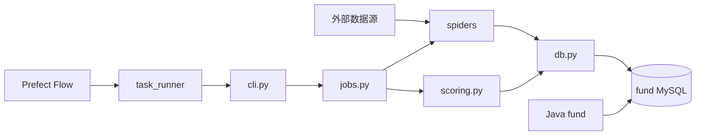

# Python 数据任务开发与运维手册

本文覆盖 `fund_spider/` 的采集、评分、数据库、测试、Prefect 调度和生产发布。表结构见 [数据库参考](../reference/DATABASE.md)，命令摘要见 [API 参考](../reference/API.md)，全量环境变量见 [配置参考](../reference/CONFIGURATION.md)。

## 1. 项目定位

Python 项目不是在线 Web API。它从外部数据源读取数据，做清洗、幂等写入和评分计算，最终由 Java `fund` 服务对外提供 API。



## 2. 技术栈与目录

`requirements.txt` 固定：Requests 2.32.3、PyMySQL 1.1.1、RapidOCR ONNX Runtime 1.3.24、Prefect 3.7.7。

| 路径 | 职责 |
| --- | --- |
| `cli.py` | 命令、参数、环境覆盖和退出失败 |
| `settings.py` | `.env` 读取和配置转换 |
| `jobs.py` | 批次选择、采集编排、事务边界和统计 |
| `db.py` | 连接、查询、DDL 兜底、Upsert 和 SQL 日志 |
| `scoring.py` | 因子、快照、评分、回测、推荐和任务队列 |
| `spiders/` | 各数据源请求与解析器 |
| `prefect_flows.py` | Flow/Task 定义 |
| `prefect.yaml` | Deployment、计划、时区和并发 |
| `runtime/task_runner.py` | 子进程、锁和日志 |
| `bin/` | 人工运行和 Prefect Server/Worker/部署脚本 |
| `sql/` | 基金库初始化与增量迁移 |
| `tests/` | `unittest` 测试 |
| `tools/` | OCR 等独立支持工具 |

## 3. 环境安装

建议 Python 3.10+；代码使用 `list[str]`、`X | None` 等现代类型语法，不能用 Python 3.8。

```bash
cd fund_spider
python3 --version
python3 -m venv .venv
source .venv/bin/activate
python -m pip install --upgrade pip
pip install -r requirements.txt
cp .env.example .env
```

验证导入：

```bash
python -c 'import requests, pymysql, prefect; print(prefect.__version__)'
python cli.py --help
```

`.env` 含数据库密码和第三方临时凭据，不得提交。

## 4. 配置优先级

1. `cli.py` 先读取项目 `.env`。
2. 已存在的进程环境变量优先于 `.env`。
3. 命令行参数映射为大写环境变量并覆盖前两者。
4. `settings.py`/调用处默认值最后兜底。

### 数据库

```env
DB_HOST=127.0.0.1
DB_PORT=3306
DB_USER=<fund_user>
DB_PASSWORD=<secret>
DB_NAME=fund
```

生产使用只对 `fund` 库有必要权限的账号。不要复用 MySQL root。

### 请求控制

```env
REQUEST_MIN_DELAY_SECONDS=1.5
REQUEST_MAX_DELAY_SECONDS=4.0
REQUEST_TIMEOUT_SECONDS=10
REQUEST_MAX_RETRIES=3
```

保持保守节奏，遵守数据源许可和服务条款。提高并发前先验证授权、限流、封禁风险和数据库吞吐。

### 批次与日志

- `FUND_CODE`：只跑一个基金。
- `FUND_LIMIT/FUND_OFFSET`：小批次验证和断点推进。
- `LOG_SQL`：输出紧凑 SQL。
- `LOG_SQL_PARAMS`：可能输出大量业务数据，生产默认关闭。
- `LOG_SQL_MAX_PARAMS`：限制参数样本数量。

历史净值、评级、持仓、资讯、股票和 Prefect 的全部变量与默认值不在本节重复，统一维护在 [配置参考](../reference/CONFIGURATION.md)。

### 第三方凭据

`YJB_AUTHORIZATION/YJB_REQUEST_SIGN/YJB_REQUEST_TIME/YJB_COOKIE` 是短期敏感值：

- 只从合法授权来源获取。
- 不写入日志、截图、Issue、README 或提交历史。
- 失效时任务应明确失败，不应无限快速重试。

## 5. CLI 命令

统一形式：

```bash
cd fund_spider
python cli.py <command> [options]
```

### 基础资料

```bash
python cli.py basic
python cli.py basic --fund-code 519674
python cli.py basic --fund-limit 10 --fund-offset 0
```

全量模式可先刷新基金代码/名称/购买状态，再逐只抓详情；单基金模式不会先拉全量列表。大批次先用 `--fund-limit` 验证。

### 当前净值与业绩

```bash
python cli.py nav-performance
```

每个源页面作为一组事务写入基金详情、净值和业绩快照，按基金代码/日期幂等更新。

### 历史净值

```bash
python cli.py nav-history \
  --fund-code 519674 \
  --start-date 20260101 \
  --end-date 2026-07-31
```

日期可用 `YYYYMMDD` 或 `YYYY-MM-DD`。边界可分别省略。并发和写批次：

```bash
python cli.py nav-history \
  --fund-limit 10 \
  --nav-page-workers 4 \
  --nav-write-batch-size 200
```

排查时把 worker 设为 1，缩小基金和日期范围；该命令默认打开 SQL/参数日志，生产运行要注意日志容量与敏感数据。

### 特征、评级、持仓

```bash
python cli.py feature --fund-code 519674
python cli.py rating
python cli.py rating --mode history --fund-code 519674
python cli.py holdings --fund-code 519674
```

持仓可传 `--year/--month/--top-line`。`cutoff_date` 是实际披露截止日，估值只应选择不晚于估值日的最近持仓。

### 资讯与股票

```bash
python cli.py news
python cli.py sina-news --max-pages 1
python cli.py stock --market cn
python cli.py stock --market hk
```

股票任务只在计划交易窗口由 Prefect 触发；代码仍需正确处理节假日、空响应和源端延迟。不要把工作日 Cron 等同于交易所开市日历。

### 评分

```bash
python cli.py score --mode current
python cli.py score --mode history --start-date 20180101 --step-months 1
python cli.py score --mode backtest --profile-id 1
python cli.py score --mode recommend
python cli.py score --mode jobs --job-limit 10
python cli.py score --mode pipeline
```

`pipeline` 依次标注成熟历史快照、计算当前分数、消费评分任务。历史模式必须保持点时数据和 12 个月隔离，禁止用今天的评级/规模回填过去。

## 6. Shell wrapper

`bin/run_*.sh` 适合人工后台运行：默认 `nohup`、打印 PID/日志路径，优先使用 `.venv/bin/python`。外部调度器要等待真实退出状态时传内部 `--foreground`：

```bash
./bin/run_feature.sh --foreground --fund-code 519674
```

Prefect 通过 `task_runner` 启动业务命令，不要再额外包一层后台 `nohup`。

### OCR 支持工具

Java `fund` 服务会调用 `tools/portfolio_holding_ocr.py`。真实图片验证需安装 `rapidocr-onnxruntime`：

```bash
cd fund_spider
.venv/bin/python tools/portfolio_holding_ocr.py \
  --source-label alipay \
  --import-type holding \
  '<test-screenshot.png>'
```

`source-label` 仅支持 `alipay/tencent`，`import-type` 仅支持 `holding/trade`。测试图片必须是授权的脱敏数据，不能提交仓库。

## 7. 新增或修改 Spider

### 推荐结构

1. 在 Spider 中定义 URL、请求参数和解析函数。
2. 解析函数接收文本/JSON，返回数据类，不直接写数据库。
3. 在 `jobs.py` 组合批次、请求和事务。
4. 在 `db.py` 新增显式查询/Upsert。
5. 在 `cli.py` 暴露人工命令参数。
6. 需要自动执行时增加 Prefect Flow/Deployment。
7. 使用固定 fixture/伪响应测试解析，不让单元测试依赖公网。

### 请求规则

- 明确超时、有限重试和指数/随机退避。
- 只重试临时错误；认证失败、参数错误和稳定解析失败应快速失败。
- 日志记录数据源、基金/页码、尝试次数和耗时，不记录凭据。
- 对页面字段变化给出可定位的异常，不能静默写空值。
- 并发请求完成后按确定顺序写入，事务大小受控。

### 解析规则

- 纯解析函数对缺字段、空字符串、`--`、日期和百分比有明确行为。
- Decimal/日期在写库前标准化；避免浮点累计误差。
- 保留必要原始 JSON 便于追溯，但不要在普通日志全量输出。
- 解析规则变化必须用历史样本做回归测试。

## 8. 数据库与幂等性

`db.py` 同时包含连接、写入和部分 DDL 兜底，维护时必须对照 `sql/init.sql` 和所有增量脚本。

一次任务应满足：

- 相同输入重复运行不会产生重复业务行。
- Upsert 唯一键与业务自然键一致。
- 一个页面/批次失败不会把已验证数据和半成品混写。
- 事务提交前所有行完成校验。
- `fund_refresh_state` 只在真实成功后更新。
- 游标只推进到最后成功位置。

生产执行 `ensure_schema` 不是迁移流程的替代品；结构变更仍需显式 SQL、备份和审阅。

## 9. 评分维护

评分链路：


维护约束：

- 同细分类比较；小样本按代码规则回退到父类。
- 权重必须通过 `validate_weights`，总和和范围不能只靠 UI。
- 回测按时间切分并保持 embargo，不做随机打散交叉验证。
- 只有通过 AUC、Brier、Top-20% win-rate-lift 等代码门槛的配置才允许激活。
- 概率和总分是不同字段；配置未验证时客户端不应显示盈利概率。

修改任何算法后先运行 `tests/test_scoring.py`，再在隔离数据库上重建小范围历史快照比较旧/新结果。

## 10. 测试

```bash
cd fund_spider
source .venv/bin/activate
python -m unittest discover -s tests -p 'test_*.py'
PYTHONPATH=.. python -m unittest tools.test_portfolio_holding_ocr
```

测试分层：

| 层 | 做法 |
| --- | --- |
| 解析单测 | 固定文本/JSON，断言字段、空值和异常 |
| Job 单测 | Fake Spider/Connection，断言批次和提交 |
| 评分单测 | 固定时序数据，断言因子、权重、泄漏保护 |
| CLI 单测 | 参数、别名、环境覆盖和失败退出 |
| Prefect 单测 | dry-run、任务选择和异常传播 |
| 集成测试 | 隔离 MySQL，小批次真实数据源（有授权时） |

网络集成测试可能受源端变化影响，不能替代确定性的解析单元测试。

## 11. Prefect 任务平台

Prefect 3.7.7 是正式调度面：Server 提供 API/UI，Process Worker 拉取 Deployment 并启动本地 Flow，PostgreSQL 保存元数据。

### 启动本地 PostgreSQL

```bash
docker compose -f deploy/prefect/docker-compose.yml up -d
docker compose -f deploy/prefect/docker-compose.yml ps
```

首次使用复制 `deploy/prefect/.env.example` 为 `.env` 并更换密码。生产不得使用示例密码。

注意：Compose 会读取 `deploy/prefect/.env`，但 `run_prefect_server.sh` 不会自动读取该文件或 `fund_spider/.env`。如果修改了 PostgreSQL 密码，本地启动 Server 前必须显式导出匹配且 URL 编码后的连接串：

```bash
export PREFECT_SERVER_DATABASE_CONNECTION_URL='postgresql+asyncpg://prefect:<url-encoded-password>@127.0.0.1:5433/prefect'
```

### Server、注册和 Worker

分别开终端：

```bash
cd fund_spider
./bin/run_prefect_server.sh
```

```bash
cd fund_spider
./bin/deploy_prefect.sh
```

```bash
cd fund_spider
./bin/run_prefect_worker.sh
```

验证：

```bash
curl -fsS http://127.0.0.1:4200/api/health
cd fund_spider
PREFECT_API_URL=http://127.0.0.1:4200/api \
  .venv/bin/prefect deployment ls
PREFECT_API_URL=http://127.0.0.1:4200/api \
  .venv/bin/prefect work-pool inspect crm-process-pool
```

### 安全试跑

```bash
PREFECT_API_URL=http://127.0.0.1:4200/api \
  .venv/bin/prefect deployment run \
  'fund-feature-refresh/feature-refresh-manual' \
  --param dry_run=true --watch
```

`dry_run` 验证任务选择和子进程链路，不写业务数据。真实运行前再检查数据库、批次和源端权限。

### 计划管理

- `prefect.yaml` 中自动计划默认启用；需要维护时先在 UI 暂停，长期变更再回写 YAML。
- UI 临时修改立即影响运行态；长期变更要回写 YAML 并重新 deploy。
- Worker 默认 4 个并发槽；行情/资讯进入高优先级 `realtime` 队列，基金/评分进入 `batch` 队列。
- 每个 Deployment 仍限制为单并发，`task_runner` 按数据类型使用独立文件锁；过期行情/资讯任务不会补抓旧快照。
- 08:00 特征任务默认按刷新状态选择最久未更新的 2000 只基金，避免全量长任务阻塞其他数据。

## 12. 日志与可观测性

排查顺序：

1. Prefect Flow Run 状态和 Task 日志。
2. Worker 的 systemd journal/终端日志。
3. `fund_spider/logs/` 的业务子进程日志。
4. `fund_refresh_state`、`fund_crawl_cursor` 和目标表新鲜度。
5. 外部响应状态/解析异常和 MySQL 锁。

日志至少包含任务名、run/trace 标识、基金/批次、开始结束、读取/写入/失败数量和耗时。不得记录数据库密码、YJB Header/Cookie 或用户上传图片内容。

## 13. CentOS 完整发布

详细 systemd 文件和命令见 `deploy/centos/README.md`。

标准流程：

1. 备份 `fund` MySQL 和 Prefect PostgreSQL。
2. 在发布目录检出确定 commit。
3. 创建/更新 `.venv` 并按锁定的 `requirements.txt` 安装。
4. 更新受保护的 `/etc/crm/fund-spider.env`，权限只给运行用户。
5. 启动 Prefect PostgreSQL 和 Server，执行健康检查。
6. `deploy_prefect.sh` 一次性注册全部 Deployment。
7. 运行一个 `dry_run=true` 和一个受控小批次真实任务。
8. 启动 Worker，确认自动计划状态并监控至少一个周期。

## 14. 回滚

1. 暂停受影响 Deployment，等待/取消运行中的 Flow（确认不会留下半事务）。
2. 恢复上一代码版本与匹配虚拟环境。
3. 重新执行上一版本的 `deploy_prefect.sh`。
4. 如果迁移不兼容，按预先批准的数据库恢复/前向修复方案处理。
5. 运行 dry-run、小批次真实任务并核对表新鲜度。
6. 恢复计划，记录回滚原因和数据影响范围。

不要删除 Prefect 命名卷作为普通回滚手段。

## 15. 故障处理

| 现象 | 可能原因 | 处理 |
| --- | --- | --- |
| `ModuleNotFoundError` | 未激活 venv/依赖不完整 | 用 `.venv/bin/python`，重装 requirements |
| MySQL 连接失败 | `.env`、网络、授权错误 | 独立 MySQL 客户端验证，只检查脱敏配置 |
| 大量 403/429 | 第三方凭据失效/限流 | 停止快速重试，更新授权或降低节奏 |
| 解析全部为空 | 源结构变化 | 保存脱敏样本、修解析器和回归测试 |
| 重复数据 | 唯一键或 Upsert 失配 | 停任务，检查自然键和写入 SQL |
| Flow pending | Worker/Pool/Queue 不在线 | Prefect work-pool 和 Worker journal |
| Flow 成功但数据旧 | `dry_run`、空批次或子任务未选中 | Flow 参数、业务日志、刷新状态 |
| 同一任务重复执行 | Deployment 或并发配置失效 | 查 Prefect Deployment、Worker 和文件锁 |
| 评分概率不显示 | 配置未通过/未激活 | 回测结果、profile 状态、pipeline |

## 16. 提交前检查

- [ ] 命令在 `cli.py` 有 help、输入校验和失败退出。
- [ ] `.env.example` 包含新变量但不含真实值。
- [ ] 请求有超时、有限重试、限速和脱敏日志。
- [ ] 写入有唯一键、事务、幂等和断点策略。
- [ ] 解析、Job、CLI/Flow 和算法测试通过。
- [ ] 新自动任务有 Flow、Deployment、时区、并发和 dry-run。
- [ ] 完整 Deployment 基线、计划和并发配置已同步。
- [ ] 数据库/API/部署文档已同步。
