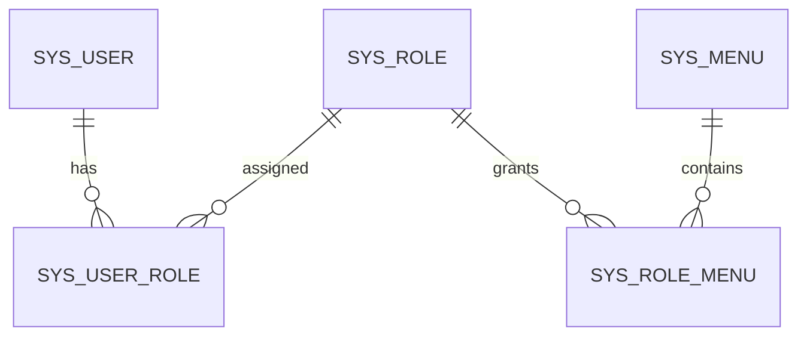
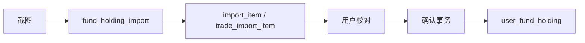

# CRM 数据库参考

系统使用三套逻辑数据库：CRM MySQL、基金 MySQL、Prefect PostgreSQL。Java 和 Python 连接配置、表归属及迁移顺序不同，不能混用初始化脚本。

## 1. 数据库总览

| 数据库 | 默认库名/端口 | 数据内容 | 主要客户端 | 初始化来源 |
| --- | --- | --- | --- | --- |
| CRM MySQL | `crm/3306` | 账号、权限、客户、访问日志 | `system/customer/admin` | `sql/schema.sql` |
| 基金 MySQL | `fund/3306` | 基金、持仓、评分、资讯、行情 | Python、Java `fund` | `fund_spider/sql/init.sql` + 增量 SQL |
| Prefect PostgreSQL | `prefect/5433` | Flow、Deployment、运行、事件和日志元数据 | Prefect Server | Prefect 自动迁移 |

`gateway` 不连 MySQL。Web/iOS/Android 不能直接连接数据库。

## 2. 本地初始化

### 新建空库

```sql
CREATE DATABASE crm CHARACTER SET utf8mb4 COLLATE utf8mb4_unicode_ci;
CREATE DATABASE fund CHARACTER SET utf8mb4 COLLATE utf8mb4_unicode_ci;
```

```bash
mysql -uroot -p crm < sql/schema.sql
mysql -uroot -p fund < fund_spider/sql/init.sql
mysql -uroot -p fund < fund_spider/sql/20260731_add_fund_scoring.sql
```

`sql/schema.sql` 先执行多条 `DROP TABLE`，只适用于全新或可丢弃环境。生产升级必须使用经过审阅的增量脚本。

### 验证

```bash
mysql -uroot -p -e 'SHOW TABLES' crm
mysql -uroot -p -e 'SHOW TABLES' fund
```

检查字符集：

```sql
SELECT TABLE_SCHEMA, DEFAULT_CHARACTER_SET_NAME, DEFAULT_COLLATION_NAME
FROM information_schema.SCHEMATA
WHERE TABLE_SCHEMA IN ('crm', 'fund');
```

## 3. CRM 表

### 账号与权限

| 表 | 主键/唯一键 | 用途 | 写入模块 |
| --- | --- | --- | --- |
| `sys_dept` | `id` | 部门树；当前接口未完整使用 | 初始化/后续系统功能 |
| `sys_user` | `id`；`username` 唯一 | 用户、密码、状态 | `system`/兼容 `admin` |
| `sys_role` | `id`；`role_code` 唯一 | 角色与数据范围 | `system`/兼容 `admin` |
| `sys_menu` | `id`；权限码有索引 | 菜单、页面和按钮权限 | `system`/兼容 `admin` |
| `sys_user_role` | `(user_id, role_id)` | 用户角色多对多 | `system`/兼容 `admin` |
| `sys_role_menu` | `(role_id, menu_id)` | 角色菜单多对多 | `system`/兼容 `admin` |
| `sys_login_log` | `id` | 登录日志预留 | 当前主链路未完整写入 |
| `sys_api_log` | `id`；trace/source/URI 索引 | 请求审计 | Gateway/服务，经 `admin` |
| `sys_dict_type` | `id`；`dict_code` 唯一 | 字典类别 | 当前接口未完整覆盖 |
| `sys_dict_data` | `id`；`dict_code` 索引 | 字典值 | 当前接口未完整覆盖 |

权限关系：



密码字段保存 Spring Security 编码字符串。初始化值 `{noop}admin123` 只用于本地；生产应使用强哈希编码并首次登录强制改密。

### CRM 业务

| 表 | 关键索引 | 用途 | 当前 API 状态 |
| --- | --- | --- | --- |
| `crm_customer` | 名称、负责人、状态 | 客户主表 | 完整 CRUD |
| `crm_contact` | `customer_id` | 联系人 | 列表、新增 |
| `crm_follow_record` | 客户、下次跟进时间 | 跟进记录 | 列表、新增 |
| `crm_opportunity` | 客户、负责人 | 商机 | 已建表，当前微服务无接口 |
| `crm_contract` | 合同号唯一、客户索引 | 合同 | 已建表，当前微服务无接口 |
| `crm_payment` | 合同、客户索引 | 回款 | 已建表，当前微服务无接口 |

没有数据库外键并不代表没有业务关系。删除客户前应由 Service 明确处理联系人、跟进、商机、合同等关联，不能依赖级联删除。

## 4. 基金基础与行情表

| 表 | 唯一键 | 内容 | 主要写入方 |
| --- | --- | --- | --- |
| `fund_detail` | `fund_code` | 基金基础资料、购买状态、规模和当前收益摘要 | Python `basic/nav-performance` |
| `user_fund_favorite` | `(username, fund_code)` | 用户自选基金 | Java `fund` |
| `fund_nav_history` | `(fund_code, nav_date)` | 历史净值与日增长 | Python |
| `fund_performance_history` | `(fund_code, snapshot_date)` | 阶段收益、费率等快照 | Python |
| `fund_feature_data` | `(fund_code, cutoff_date, period_label)` | 标准差、夏普比率 | Python |
| `fund_rating` | `(fund_code, rating_date)` | 多机构评级 | Python |
| `fund_stock_holding` | 以实际 DDL 唯一键为准 | 基金披露的股票持仓 | Python |
| `fund_refresh_state` | `(fund_code, data_type)` | 最近刷新时间与行数 | Python |
| `fund_crawl_cursor` | `(job_name, cursor_date)` | 批量任务断点/游标 | Python |

`fund_nav_history`、`fund_performance_history` 等使用幂等 Upsert。修改唯一键前必须同步 Python SQL、Java Mapper、历史去重方案和回滚脚本。

## 5. 用户持仓与 OCR

| 表 | 作用 | 写入阶段 |
| --- | --- | --- |
| `fund_holding_import` | 一次截图导入批次、来源和状态 | OCR 预览创建 |
| `fund_holding_import_item` | OCR 识别出的持仓候选行 | OCR 预览 |
| `fund_holding_trade_import_item` | 交易明细识别和调整 | 交易明细预览/确认 |
| `user_fund_holding` | 用户最终持仓 | 用户确认后 |



维护原则：

- 图片识别结果是候选数据，未确认前不能进入最终持仓。
- `username` 和 `source_label` 构成重要隔离维度；查询/更新不能跨用户或跨平台。
- 持仓快照覆盖同平台数据；交易明细只调整同平台已有基金。
- 确认流程必须保持事务性，失败时不能留下半批更新。

## 6. 评分表

评分增量脚本是 `fund_spider/sql/20260731_add_fund_scoring.sql`。

| 表 | 作用 | 写入方 |
| --- | --- | --- |
| `fund_scale_history` | 历史规模快照 | Python |
| `fund_score_profile` | 权重配置、状态、激活标记 | Java API/Python推荐 |
| `fund_score_factor_snapshot` | 截止某日的点时因子和未来标签 | Python |
| `fund_score_result` | 当前/历史评分和概率 | Python |
| `fund_score_backtest` | 时序回测指标和折叠结果 | Python |
| `fund_score_job` | 回测/推荐异步任务队列 | Java 入队、Python 消费 |

关键约束：

1. 历史快照只能使用快照日当时可获得的数据，不能泄漏未来信息。
2. 未来一年盈利标签必须等观察窗口成熟后再写入。
3. Java 激活配置前检查回测门槛；接口入队成功不代表任务成功。
4. `fund_score_job` 消费必须支持失败状态和重复执行保护。

## 7. 资讯与股票

| 表 | 唯一键 | 内容 | 写入命令 |
| --- | --- | --- | --- |
| `yangjibao_news` | `news_id` | 养基宝资讯原文与原始 JSON | `news` |
| `sina_finance_news` | `news_id` | 新浪 7x24 资讯、频道、图片 | `sina-news` |
| `stock_detail` | `stock_code` | 股票名称、市场、交易所、上市日 | `stock` |
| `stock_daily_history` | `(stock_code, trade_date)` | 行情、估值、资金和备注 | `stock` |

`source_json/raw_json` 用于审计与重新解析，可能体积较大。日志中不得输出第三方鉴权 Header、Cookie 或完整敏感原文。

## 8. 数据写入矩阵

| 数据域 | Python | Java System | Java Customer | Java Fund | Admin |
| --- | :---: | :---: | :---: | :---: | :---: |
| 用户/角色/菜单 | - | R/W | - | R（JWT） | 兼容 R/W |
| 客户/联系人/跟进 | - | - | R/W | - | 兼容 R/W |
| 基金采集数据 | W | - | - | R，少量 CRUD | - |
| 用户自选/持仓 | OCR 支持工具 | - | - | R/W | - |
| 评分任务/结果 | R/W | - | - | 入队/读取/激活 | - |
| 资讯/股票 | W | - | - | R/资讯删除 | - |
| API 日志 | - | 过滤器 | 过滤器 | 过滤器 | W |

R/W 是业务归属，不表示数据库权限当前已经按最小权限拆分。生产建议为各服务创建独立 MySQL 用户并只授权所需库。

## 9. 迁移规则

### 新迁移命名

```text
sql/YYYYMMDD_<purpose>.sql
fund_spider/sql/YYYYMMDD_<purpose>.sql
```

CRM 迁移放 `sql/`，基金迁移放 `fund_spider/sql/`。一个迁移文件只解决一个明确目的。

### 发布前

1. 在与生产相同主版本的 MySQL 备份副本上执行。
2. 记录执行前表结构、行数、磁盘空间和预计锁表时间。
3. 明确 DDL 是否可逆；不可逆迁移必须先创建备份表或制定前向修复方案。
4. 检查 Java/Python 新旧版本是否能与迁移前后结构短暂共存。
5. 使用 `SHOW WARNINGS`、数据校验 SQL 和应用测试验证。

### 生产执行模板

```bash
mysql -h '<db-host>' -u '<migration-user>' -p \
  --show-warnings --force=false '<database>' \
  < '<reviewed-migration.sql>'
```

不要把密码放在命令参数中。实际执行前根据 MySQL 客户端版本确认选项，维护窗口内由有权限的操作员执行。

### 发布后校验

```sql
SELECT COUNT(*) FROM <affected_table>;
SHOW CREATE TABLE <affected_table>;
```

再执行对应 API 和 Python dry-run/小批次任务。只验证 DDL 成功不算业务迁移完成。

## 10. 备份与恢复

### MySQL 逻辑备份

```bash
mysqldump -h '<db-host>' -u '<backup-user>' -p \
  --single-transaction --routines --triggers \
  crm > 'crm-backup-YYYYMMDDHHMM.sql'

mysqldump -h '<db-host>' -u '<backup-user>' -p \
  --single-transaction --routines --triggers \
  fund > 'fund-backup-YYYYMMDDHHMM.sql'
```

大库应使用组织批准的物理备份/PITR 方案。备份完成后至少验证文件非空、校验和、保留策略，并定期做隔离环境恢复演练。

### Prefect PostgreSQL

本地 Compose 使用命名卷 `crm-prefect-postgres-data`。正常升级禁止执行 `docker compose down -v`。生产备份应使用 `pg_dump` 或平台快照，并验证 Prefect Server 能在恢复副本上读取 Deployment 与运行记录。

业务 MySQL 和 Prefect PostgreSQL 必须分别备份；只备份其中一个不能完整恢复系统。

## 11. 常用诊断

### 连接与当前库

```sql
SELECT DATABASE(), CURRENT_USER(), @@version, @@character_set_database, @@collation_database;
```

### 长事务与锁

```sql
SHOW FULL PROCESSLIST;
SELECT * FROM information_schema.INNODB_TRX ORDER BY trx_started;
```

### 数据新鲜度

```sql
SELECT MAX(nav_date) FROM fund_nav_history;
SELECT MAX(create_time) FROM sina_finance_news;
SELECT MAX(trade_date) FROM stock_daily_history;
SELECT data_type, MAX(last_success_at) FROM fund_refresh_state GROUP BY data_type;
```

### 孤立业务关系

```sql
SELECT c.id, c.customer_id
FROM crm_contact c
LEFT JOIN crm_customer p ON p.id = c.customer_id
WHERE p.id IS NULL;
```

根据真实关系为联系人、跟进、用户角色、角色菜单和持仓数据增加同类检查。

## 12. 数据库变更检查表

- [ ] 选择了正确数据库，没有在 `crm` 执行基金脚本或反之。
- [ ] 增量脚本不含无保护的 `DROP TABLE`、全表 `DELETE` 或不可控重建。
- [ ] 唯一键、索引、空值和字符集与代码假设一致。
- [ ] Java Entity/Mapper/DTO、Python SQL/数据类和客户端字段已同步。
- [ ] 写入者与读取者能跨新旧版本兼容发布窗口。
- [ ] 已备份、验证备份并记录恢复命令和负责人。
- [ ] 已验证行数、关键聚合、API 和至少一个真实业务流程。
- [ ] 未将生产连接串、账号或备份文件提交到仓库。
